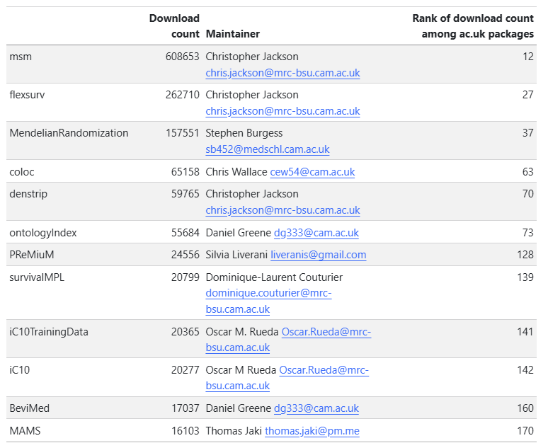

```{r setup, include=FALSE}
options(htmltools.dir.version = FALSE)
knitr::opts_chunk$set(
  echo = TRUE,
  warning = FALSE,
  message = FALSE,
  fig.retina = 3,
  fig.align = "center"
)
```


# Overview

.pull-left[
## Suggestions

1. **Package maintenance features (Roxygen2 documentation)**
2. **Package dissemination/availability (pkgdown Website)**
3. **Some code optimization (e.g. `crossprod()`)**
4. **Memory Usage profiling**
5. **Roadmap**
]

.pull-right[
## Outcome

- Better maintainability
- Improved discoverability
- Memory usage reduction
- Faster execution
- Cleaner codebase
]

---

class: inverse, center, middle

# 1. Roxygen2 Structure

---

# Roxygen2 Documentation

.pull-left[
### Before
```r
# Manual NAMESPACE edits
# Separate .Rd files
# Sync issues between 
# code and docs
```

**Problems:**
- Error-prone manual updates
- Documentation drift
- Time-consuming maintenance
]

.pull-right[
### After
```r
#' Penalized Cox PH Model
#'
#' @param formula Survival formula
#' @param data Data frame
#' @param control Control object
#' @return coxph_mpl object
#' @export
coxph_mpl <- function(formula, 
                      data, 
                      control = NULL) {
  # implementation
}
```

**Benefits:**
- Code and docs stay in sync
- Auto-generated NAMESPACE
- Consistent formatting
]

---

class: inverse, center, middle

# 2. pkgdown Website

---

# pkgdown Site

.pull-left[
### Features

- **Modern UI**: Bootstrap 5 with light/dark mode
- **Reference**: Searchable function docs
- **Vignettes**: Getting started guides
- **News**: Changelog integration
]

.pull-right[
### Structure

```yaml
_pkgdown.yml:
  template:
    bootstrap: 5
    light-switch: true
  
  home:
    sidebar:
      structure: [links, license, 
                  citation, authors]
  
  navbar:
    left: [home, reference, 
           articles, news]
```
]

---

# Package dissemination
Packages by authors who have worked at BSU, downloaded from the RStudio CRAN mirror in the QQR period (2023-03-01 up to 2025-12-01)


---

class: inverse, center, middle

# 3. Code optimization

---

# Large Memory Usage

### Original Approach

```r
# Computing weighted cross-product
M_hessbeta <- t(M_X) %*% diag(c(weights), n, n) %*% M_X
```

--

### Issues

- Creates **full n×n diagonal matrix** in memory
- Leads to excessive memory usage just for `diag()`
--

### Toy sample

```r
n <- 5000
diag(weights, n, n)  # 5000×5000 matrix = 191 MB theoretical
                      # Actual allocation: ~192 MB
                      # But this is created, multiplied, then discarded
                      # EVERY inner iteration
```

---

# Two-Step Fix

.pull-left[
### Intermediate Step (v2)

```r
# Element-wise multiplication
# Pre-computed transpose
M_tX <- t(M_X)
M_hessbeta <- M_tX %*% (c(weights) * M_X)
```

**Result**: Memory usage reduction

### Final Step (v3)

```r
# Use crossprod() directly
M_hessbeta <- crossprod(M_X, 
                        c(weights) * M_X)
```

**Benefits:**  
• Cleaner code (no stored transpose)  
• Potential BLAS optimization  
• Same memory efficiency
]
--
.pull-right[
### Benchmark (n=5000)
```r
bench::mark(
"v1_diag" = t(M_X) %*% diag(c(weights), n, n) %*% M_X,
"v2_elementwise" = t(M_X) %*% (c(weights) * M_X),
"v3_crossprod" = crossprod(M_X, c(weights) * M_X),
  iterations = 100,
  check = TRUE  # Verify all produce same result
)
```
### Benchmark Results

```
# A tibble: 3 × 6
  expression      median mem_alloc total_time
  <bch:expr>      <bch:> <bch:byt>   <bch:tm>
1 v1_diag          214ms     192MB   23.4s
2 v2_elementwise   487µs     821KB   73.6ms  
3 v3_crossprod     512µs     431KB   64.5ms  
```
]

---

# crossprod() Under the Hood

.pull-left[
### Mathematical Identity

```r
crossprod(X, w * X)
# Equivalent to:
t(X) %*% (w * X)
```

But `crossprod()`:
- Avoids explicit transpose
- Optimized BLAS call
- Better cache locality

]

---

class: inverse, center, middle

# 4. Memory Usage profiling

---
# Memory Profiling Results

**Current memory usage**
```text
# A tibble: 3 × 13
  expression   min median `itr/sec` mem_alloc `gc/sec` n_itr  n_gc total_time
  <bch:expr> <dbl>  <dbl>     <dbl> <bch:byt>    <dbl> <int> <dbl>      <dbl>
1 right       11.9   11.9    0.0842    1.83GB    0.253     1     3       11.9
2 left        42.1   42.1    0.0238   21.62GB    0.642     1    27       42.1
3 interval    15.4   15.4    0.0648    5.49GB    0.454     1     7       15.4
```

**Potential benefits**
```text
# A tibble: 3 × 13
  expression   min median `itr/sec` mem_alloc `gc/sec` n_itr  n_gc total_time
  <bch:expr> <dbl>  <dbl>     <dbl> <bch:byt>    <dbl> <int> <dbl>      <dbl>
1 right       8.66   8.66    0.115     1.15GB    0.346     1     3       8.66
2 left       31.9   31.9     0.0314     4.8GB    0.314     1    10      31.9 
3 interval   11.4   11.4     0.0874     2.7GB    0.175     1     2      11.4 
```

---
# Melanoma dataset profiling

```r
bench::mark(
"fit"   = try(coxph_mpl(
            formula=Surv(left,right,type="interval2")~location+breslow.mm+gender+ctrd.age,
            data=dataw,basis="m",
            tol=1e-6,n.knots=c(7,0),range.quant = c(0,1),
            max.iter=c(1000,10000,500000)),silent=TRUE),
            iterations = 1
)
```
--
**Current memory usage**
```text
# A tibble: 1 × 13
  expression      min median `itr/sec` mem_alloc `gc/sec` n_itr  n_gc total_time
  <bch:expr> <bch:tm> <bch:>     <dbl> <bch:byt>    <dbl> <int> <dbl>   <bch:tm>
1 fit           3.01m  3.01m   0.00553     115GB     4.21     1   762      3.01m
```
--
**New Approach**
```text
# A tibble: 1 × 13
  expression      min median `itr/sec` mem_alloc `gc/sec` n_itr  n_gc total_time
  <bch:expr> <bch:tm> <bch:>     <dbl> <bch:byt>    <dbl> <int> <dbl>   <bch:tm>   
1 fit           8.12s  8.12s     0.123    4.12GB     3.20     1    26      8.12s   
```

---
class: inverse, center, middle
# 5. Roadmap

---
# Roadmap

.pull-left[
## Short-term

- Roxygen2 structure
- pkgdown documentation website
- `crossprod()` optimization
- Memory profiling & validation
- Modularity
]
--

.pull-right[
## Medium-term

**Selective C/C++ for Hot Paths**  
*Candidates (from profiling):*

- Hazard/survival calculations 
- Log-likelihood contributions 
]
