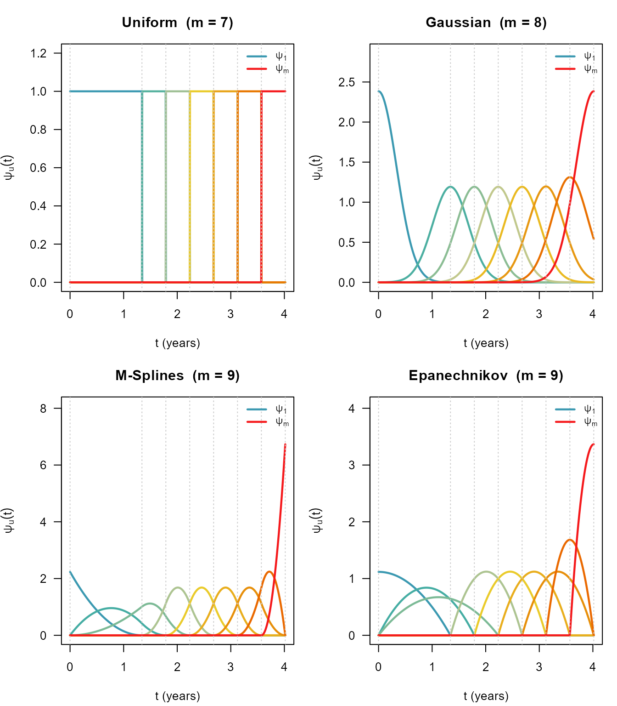
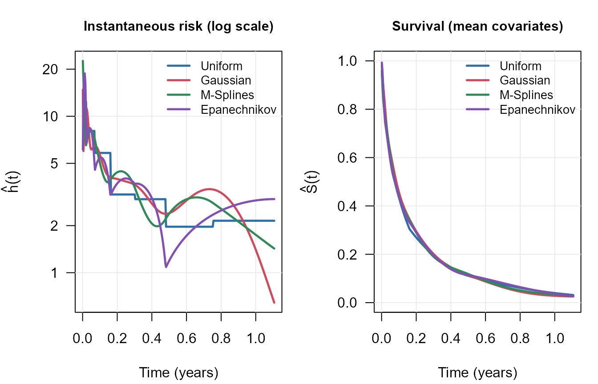

# Basis Functions for the Baseline Hazard

## The MPL baseline hazard expansion

The Cox proportional hazards model specifies the hazard for subject
$`i`$ as

``` math
h(t_i) = h_0(t_i)\,e^{\mathbf{x}_i^T \boldsymbol{\beta}},
```

where $`\boldsymbol{\beta}`$ collects the regression coefficients and
$`h_0(\cdot)`$ is an unspecified baseline hazard. Maximum penalised
likelihood (MPL) estimation approximates $`h_0`$ by a finite mixture of
non-negative *basis functions* $`\psi_1, \ldots, \psi_m`$:

``` math
h_0(t) = \sum_{u=1}^{m} \theta_u\,\psi_u(t), \qquad
H_0(t) = \int_{t_{(1)}}^{t} h_0(v)\,dv = \sum_{u=1}^{m} \theta_u\,\Psi_u(t),
```

where $`\Psi_u(t) = \int_{t_{(1)}}^{t}\psi_u(v)\,dv`$ is the cumulative
basis and
$`\boldsymbol{\theta} = (\theta_1,\ldots,\theta_m)^T \geq \mathbf{0}`$
are coefficients estimated alongside $`\boldsymbol{\beta}`$(Ma et al.
2014, 2024).

`survivalMPL` provides four production basis types, selectable via the
`basis` argument of
[`coxph_mpl.control()`](https://CRAN.R-project.org/package=survivalMPL/reference/coxph_mpl.control.md):

| `basis` string | Description |
|----|----|
| `"uniform"` (or `"u"`) | Piecewise-constant (step function) |
| `"gaussian"` (or `"g"`) | Truncated Gaussian kernels |
| `"msplines"` (or `"m"`) | M-splines of order $`o`$ |
| `"epanechikov"` (or `"e"`, `"epanechnikov"`) | Epanechnikov kernels |

The rest of this article presents the mathematical definition of each
basis, visualises the shapes, and compares fits on the bundled
`melanoma` dataset.

------------------------------------------------------------------------

## Uniform (step-function) basis

The time range $`[t_{(1)}, t_{(n)}]`$ is partitioned into $`m`$ adjacent
intervals $`[\alpha_u, \alpha_{u+1})`$. The density and cumulative bases
are

``` math
\psi_u(t) = \mathbf{1}(\alpha_u \leq t < \alpha_{u+1}),
```

``` math
\Psi_u(t) = \mathbf{1}(\alpha_u \leq t)
  \Bigl[t^{\mathbf{1}(t < \alpha_{u+1})}\,\alpha_{u+1}^{\mathbf{1}(\alpha_{u+1} \leq t)}
        - \alpha_u\Bigr].
```

Each $`\theta_u`$ is then interpreted directly as the constant hazard
rate on $`[\alpha_u, \alpha_{u+1})`$.

------------------------------------------------------------------------

## Gaussian basis

Basis function $`u`$ is a truncated Gaussian density centred at knot
$`\alpha_u`$ with scale $`\sigma_u`$:

``` math
\psi_u(t) = \frac{1}{\sigma_u\,\delta_u}\,
  \phi\!\left(\frac{t - \alpha_u}{\sigma_u}\right), \qquad
\Psi_u(t) = \frac{1}{\delta_u}
  \left[\Phi\!\left(\frac{t - \alpha_u}{\sigma_u}\right)
       -\Phi\!\left(\frac{t_{(1)} - \alpha_u}{\sigma_u}\right)\right],
```

where $`\phi`$ and $`\Phi`$ are the standard normal density and CDF, and
$`\delta_u = \Phi\!\left(\tfrac{t_{(n)}-\alpha_u}{\sigma_u}\right)
           -\Phi\!\left(\tfrac{t_{(1)}-\alpha_u}{\sigma_u}\right)`$
ensures each truncated basis integrates to 1 on $`[t_{(1)}, t_{(n)}]`$.

------------------------------------------------------------------------

## M-spline basis

M-splines of order $`o`$ are built recursively from augmented knots
$`\boldsymbol{\alpha}^\star = \bigl[\alpha_1 \mathbf{1}_{o-1}^T,\,\boldsymbol{\alpha}^T,\,\alpha_{n_\alpha}\mathbf{1}_{o-1}^T\bigr]^T`$:

``` math
\psi^o_u(t) =
\begin{cases}
\dfrac{\mathbf{1}(\alpha^\star_u \leq t < \alpha^\star_{u+1})}
      {\alpha^\star_{u+1} - \alpha^\star_u} & o = 1,\\[8pt]
\dfrac{o}{o-1}
\dfrac{\mathbf{1}(\alpha^\star_u \leq t < \alpha^\star_{u+o})}
      {\alpha^\star_{u+o} - \alpha^\star_u}
\Bigl[(t-\alpha^\star_u)\,\psi^{o-1}_u(t)
     +(\alpha^\star_{u+o}-t)\,\psi^{o-1}_{u+1}(t)\Bigr] & \text{otherwise.}
\end{cases}
```

The cumulative $`\Psi^o_u(t)`$ is an I-spline (integrated M-spline);
each $`\psi^o_u`$ integrates to 1 over its support
$`[\alpha^\star_u, \alpha^\star_{u+o}]`$. `survivalMPL` defaults to
$`o = 3`$ (cubic M-splines), for which the second-order roughness
penalty has a closed form.

------------------------------------------------------------------------

## Epanechnikov basis

Epanechnikov basis functions have compact parabolic support. For the
interior functions ($`1 < u < m`$):

``` math
\psi_u(t) = \frac{6\,\mathbf{1}(\alpha^\star_u \leq t < \alpha^\star_{u+o})
  (t - \alpha^\star_u)(t - \alpha^\star_{u+o})}{(\alpha^\star_u - \alpha^\star_{u+o})^3}.
```

The endpoint functions ($`u = 1`$ and $`u = m`$) use asymmetric variants
to ensure a proper probability density on their support. Like M-splines,
these use the augmented knot sequence $`\boldsymbol{\alpha}^\star`$.

------------------------------------------------------------------------

## Visual comparison

The code below uses the package’s internal basis machinery to evaluate
$`\psi_u(t)`$ on a fine grid and plot each set of basis functions.

`n.knots = c(k_1, k_2)` places $`k_1 + 1`$ quantile-based knots over the
lower `range.quant[2]` (90% by default) of the event times, plus
$`k_2 + 1`$ equally spaced knots above that quantile, giving
$`k_1 + k_2 + 2`$ knots in total. The defaults are `c(8, 2)` for
`"uniform"` and `"msplines"` (12 knots, $`m = 11`$ and $`13`$) and
`c(0, 20)` for `"gaussian"` and `"epanechikov"` (22 knots, $`m = 22`$
and $`23`$).

The figure below deliberately uses far fewer: `n.knots = c(0, 6)`,
i.e. 8 widely spaced knots and $`m = 7`$ to $`9`$ basis functions per
panel. At the default resolution the curves overlap into a dense,
unreadable thicket, and on this right-skewed dataset the quantile knots
crowd so tightly near $`t = 0`$ that the first basis function spikes and
flattens all the others. Fewer knots do not change the shape of an
individual basis function, only how many there are and how wide each one
is.



Colour runs with the basis index: $`\psi_1`$ (blue) is left-most in
time, $`\psi_m`$ (red) right-most. Dotted vertical lines mark the knots
$`\boldsymbol{\alpha}`$.

------------------------------------------------------------------------

## Fitting comparison on `melanoma`

The choice of basis affects the smoothness and shape of the estimated
baseline hazard but rarely changes regression coefficient estimates
substantially. Here we fit the same interval-censored model with all
four bases using the bundled pseudo-melanoma data (time to first local
recurrence, $`n = 300`$, true baseline $`h_0(t) = t^{-1/2}`$).

All four fits share the same knot specification, `n.knots = c(8, 2)`, so
that the comparison is between *basis shapes* and not between different
numbers of parameters. (The defaults differ by basis: `"uniform"` and
`"msplines"` use `c(8, 2)`, while `"gaussian"` and `"epanechikov"` use
`c(0, 20)`.)

[`data`](https://rdrr.io/r/utils/data.html)`(``melanoma``)`` ``formula_mel`` ``<-`` `[`Surv`](https://rdrr.io/pkg/survival/man/Surv.html)`(``t_L``, ``t_R``, type ``=`` ``"interval2"``)`` ``~`` `` ``Arm`` ``+`` ``Leg`` ``+`` ``Trunk`` ``+`` ``mm1to2`` ``+`` ``mm2to4`` ``+`` ``mm4plus`` ``+`` ``Female`` ``+`` ``Age_centred`` ``n_obs`` ``<-`` `[`sum`](https://rdrr.io/r/base/sum.html)`(``melanoma``$``t_L`` ``==`` ``melanoma``$``t_R`` ``&`` `[`is.finite`](https://rdrr.io/r/base/is.finite.html)`(``melanoma``$``t_R``)``)`` ``base_ctrl`` ``<-`` `[`list`](https://rdrr.io/r/base/list.html)`(``n.obs ``=`` ``n_obs``,`` `` smooth ``=`` ``0``,`` `` n.knots ``=`` `[`c`](https://rdrr.io/r/base/c.html)`(``8``, ``2``)``,`` `` max.iter ``=`` `[`c`](https://rdrr.io/r/base/c.html)`(``40``, ``2e4``, ``5e4``)``)`

`fit_u`` ``<-`` `[`coxph_mpl`](https://CRAN.R-project.org/package=survivalMPL/reference/coxph_mpl.md)`(``formula_mel``, data ``=`` ``melanoma``,`` `` control ``=`` `[`do.call`](https://rdrr.io/r/base/do.call.html)`(``coxph_mpl.control``,`` `` `[`c`](https://rdrr.io/r/base/c.html)`(``base_ctrl``, `[`list`](https://rdrr.io/r/base/list.html)`(``basis ``=`` ``"uniform"``)``)``)``)`` `` ``fit_g`` ``<-`` `[`coxph_mpl`](https://CRAN.R-project.org/package=survivalMPL/reference/coxph_mpl.md)`(``formula_mel``, data ``=`` ``melanoma``,`` `` control ``=`` `[`do.call`](https://rdrr.io/r/base/do.call.html)`(``coxph_mpl.control``,`` `` `[`c`](https://rdrr.io/r/base/c.html)`(``base_ctrl``, `[`list`](https://rdrr.io/r/base/list.html)`(``basis ``=`` ``"gaussian"``)``)``)``)`` `` ``fit_m`` ``<-`` `[`coxph_mpl`](https://CRAN.R-project.org/package=survivalMPL/reference/coxph_mpl.md)`(``formula_mel``, data ``=`` ``melanoma``,`` `` control ``=`` `[`do.call`](https://rdrr.io/r/base/do.call.html)`(``coxph_mpl.control``,`` `` `[`c`](https://rdrr.io/r/base/c.html)`(``base_ctrl``, `[`list`](https://rdrr.io/r/base/list.html)`(``basis ``=`` ``"msplines"``)``)``)``)`` `` ``fit_e`` ``<-`` `[`coxph_mpl`](https://CRAN.R-project.org/package=survivalMPL/reference/coxph_mpl.md)`(``formula_mel``, data ``=`` ``melanoma``,`` `` control ``=`` `[`do.call`](https://rdrr.io/r/base/do.call.html)`(``coxph_mpl.control``,`` `` `[`c`](https://rdrr.io/r/base/c.html)`(``base_ctrl``, `[`list`](https://rdrr.io/r/base/list.html)`(``basis ``=`` ``"epanechikov"``)``)``)``)`

### Regression coefficients

`coef_mat`` ``<-`` `[`cbind`](https://rdrr.io/r/base/cbind.html)`(`` `` Uniform ``=`` `[`coef`](https://rdrr.io/r/stats/coef.html)`(``fit_u``)``,`` `` Gaussian ``=`` `[`coef`](https://rdrr.io/r/stats/coef.html)`(``fit_g``)``,`` ```  `M-Splines`  ```=`` `[`coef`](https://rdrr.io/r/stats/coef.html)`(``fit_m``)``,`` `` Epanechnikov ``=`` `[`coef`](https://rdrr.io/r/stats/coef.html)`(``fit_e``)`` ``)`` `[`round`](https://rdrr.io/r/base/Round.html)`(``coef_mat``, ``3``)`` ``#> Uniform Gaussian M-Splines Epanechnikov`` ``#> Arm -0.596 -0.583 -0.562 -0.620`` ``#> Leg -0.112 -0.085 -0.087 -0.111`` ``#> Trunk -0.241 -0.243 -0.239 -0.252`` ``#> mm1to2 0.036 0.053 0.029 0.056`` ``#> mm2to4 0.614 0.672 0.625 0.642`` ``#> mm4plus 1.472 1.468 1.436 1.454`` ``#> Female -0.090 -0.077 -0.089 -0.088`` ``#> Age_centred 0.117 0.114 0.111 0.119`

### Estimated baseline hazards



All four bases agree on the broad picture: a hazard that falls steeply
over the first few weeks and then levels off, and survival curves that
are nearly identical. The hazard estimates themselves are not nearly
identical, and the log scale is what shows it. The uniform basis gives
the expected step artefacts, while the three smooth bases oscillate, and
disagree about where the peaks and troughs fall, because `smooth = 0`
applies no roughness penalty at all. Penalised fits (`smooth > 0`, or
`smooth.per = TRUE` for automatic selection) damp these oscillations.
That the four disagree this much on $`\hat h_0`$ while agreeing on
$`\hat S_0`$ is the usual picture: the survival curve integrates the
hazard, and integration smooths the differences away.

These are predictions at the *mean* covariate vector, so each curve
estimates $`h_0(t)\exp(\bar{\mathbf{x}}^T\boldsymbol{\beta})`$ rather
than $`h_0(t)`$ itself. The covariates are not centred, so the level of
these curves is not the level of the baseline hazard.

------------------------------------------------------------------------

## Practical guidance

- **`"msplines"` (default for interval-censored data)** - M-splines
  offer a good balance of smoothness and computational efficiency. The
  second-order roughness penalty has an exact closed form.

- **`"uniform"`** - fast and simple; useful as a baseline comparison.
  Use more knots (`n.knots`) if the hazard is not close to
  piecewise-constant.

- **`"gaussian"`** - smooth, kernel-based; both first- and second-order
  roughness penalties are available. Can be slow with many knots.

- **`"epanechnikov"`** - compact support like M-splines but with
  parabolic rather than polynomial shape; only the second-order penalty
  is supported.

------------------------------------------------------------------------

## Extensibility

The basis registry (`R/basis.R`) allows new basis types to be added
without modifying existing code. The file `R/basis-bsplines.R` includes
a skeleton showing how to implement the three required functions
(`knots_fn`, `matrix_fn`, `penalty_fn`) and how to call
[`register_basis()`](https://CRAN.R-project.org/package=survivalMPL/reference/register_basis.md).\
See
[`?list_bases`](https://CRAN.R-project.org/package=survivalMPL/reference/list_bases.md)
for the full list of registered bases.

------------------------------------------------------------------------

## References

Ma, Jun, Stephane Héritier, and Serigne N. Lo. 2014. “On the Maximum
Penalized Likelihood Approach for Proportional Hazard Models with Right
Censored Survival Data.” *Computational Statistics & Data Analysis* 74:
142–56. <https://doi.org/10.1016/j.csda.2014.01.005>.

Ma, Jun, Annabel Webb, and Harold Malcolm Hudson. 2024. *Likelihood
Methods in Survival Analysis: With R Examples*. 1st ed. Chapman;
Hall/CRC. <https://doi.org/10.1201/9781351109710>.
