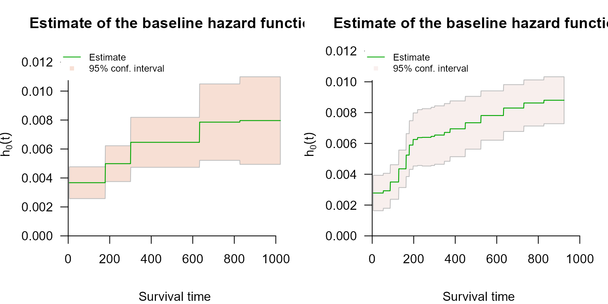

# Control Parameters

## Overview

[`coxph_mpl()`](https://CRAN.R-project.org/package=survivalMPL/reference/coxph_mpl.md)
runs with defaults that work for most datasets, so the tutorials call it
with nothing but a formula and a data frame. When a fit needs tuning - a
different baseline hazard basis, more or fewer knots, a fixed smoothing
value, longer iteration limits - the settings live in
[`coxph_mpl.control()`](https://CRAN.R-project.org/package=survivalMPL/reference/coxph_mpl.control.md).

There are two equivalent ways to change them:

`# 1. pass control arguments directly; coxph_mpl() forwards them`` `[`coxph_mpl`](https://CRAN.R-project.org/package=survivalMPL/reference/coxph_mpl.md)`(`[`Surv`](https://rdrr.io/pkg/survival/man/Surv.html)`(``time``, ``status``)`` ``~`` ``x``, data ``=`` ``df``, basis ``=`` ``"msplines"``, tol ``=`` ``1e-5``)`` `` ``# 2. build the control object explicitly`` `[`coxph_mpl`](https://CRAN.R-project.org/package=survivalMPL/reference/coxph_mpl.md)`(`[`Surv`](https://rdrr.io/pkg/survival/man/Surv.html)`(``time``, ``status``)`` ``~`` ``x``, data ``=`` ``df``,`` `` control ``=`` `[`coxph_mpl.control`](https://CRAN.R-project.org/package=survivalMPL/reference/coxph_mpl.control.md)`(``n.obs ``=`` `[`sum`](https://rdrr.io/r/base/sum.html)`(``df``$``status``)``,`` `` basis ``=`` ``"msplines"``, tol ``=`` ``1e-5``)``)`

The first form is shorter and is what the other articles use. The second
is needed when the same settings are reused across several fits. Note
the `n.obs` argument in the second form:
[`coxph_mpl.control()`](https://CRAN.R-project.org/package=survivalMPL/reference/coxph_mpl.control.md)
uses the number of fully observed events to set defaults, and cannot
count them itself, so a hand-built control object must be told. Called
through `...`,
[`coxph_mpl()`](https://CRAN.R-project.org/package=survivalMPL/reference/coxph_mpl.md)
counts them for you.

A control object is a plain list with validated entries:

[`library`](https://rdrr.io/r/base/library.html)`(`[`survivalMPL`](https://CRAN.R-project.org/package=survivalMPL)`)`` ``#> Loading required package: survival`` ``#> Loading required package: MASS`` `[`library`](https://rdrr.io/r/base/library.html)`(`[`survival`](https://github.com/therneau/survival)`)`` `` `[`str`](https://rdrr.io/r/utils/str.html)`(`[`coxph_mpl.control`](https://CRAN.R-project.org/package=survivalMPL/reference/coxph_mpl.control.md)`(``n.obs ``=`` ``165``)``)`` ``#> List of 16`` ``#> $ basis : chr "uniform"`` ``#> $ smooth : num 0`` ``#> $ max.iter : int [1:3] 150 75000 1000000`` ``#> $ tol : num 1e-07`` ``#> $ order : int 3`` ``#> $ penalty : int 2`` ``#> $ n.knots : num [1:2] 8 2`` ``#> $ range.quant : num [1:2] 0.075 0.9`` ``#> $ cover.sigma.quant: num 0.25`` ``#> $ cover.sigma.fixed: num 0.25`` ``#> $ n.events_basis : int 10`` ``#> $ min.theta : num 1e-10`` ``#> $ ties : chr "epsilon"`` ``#> $ seed : int(0) `` ``#> $ kappa : num 1.67`` ``#> $ epsilon : num [1:2] 1e-16 1e-10`` ``#> - attr(*, "class")= chr "coxph_mpl.control"`

Every argument is validated on the way in: values outside their
admissible range are silently replaced by the default rather than passed
on to the optimiser, so an impossible setting cannot produce a
meaningless fit.

------------------------------------------------------------------------

## The baseline hazard

### `basis`

Which family of non-negative functions $`\psi_1,\ldots,\psi_m`$ is used
to build $`h_0(t) = \sum_u \theta_u \psi_u(t)`$:

| Value | Aliases | Shape |
|----|----|----|
| `"uniform"` | `"u"`, `"uni"` | Piecewise-constant step functions (default) |
| `"msplines"` | `"m"`, `"ms"` | M-splines of order `order` |
| `"gaussian"` | `"g"`, `"gauss"` | Truncated Gaussian kernels |
| `"epanechikov"` | `"e"`, `"epa"`, `"epanechnikov"` | Epanechnikov kernels |

`"uniform"` is the fastest and gives coefficients $`\theta_u`$ that read
directly as the hazard rate on knot interval $`u`$. `"msplines"` is the
usual choice when a smooth $`\hat h_0`$ matters, in particular for
interval-censored data where $`H_0`$ enters the likelihood at both
endpoints. **Basis Functions for the Baseline Hazard** defines each one
and compares them on the same data.

### `n.knots` and `range.quant`

`n.knots` is a length-2 vector `c(k1, k2)`. The first entry places
$`k_1 + 1`$ knots at quantiles of the observed event times up to
`range.quant[2]` (the 90th percentile by default); the second places
$`k_2 + 1`$ equally spaced knots above that quantile. When `k2 = 0`, all
knots are quantile-based over the whole range. Defaults are `c(8, 2)`
for `"uniform"` and `"msplines"`, and `c(0, 20)` for the two kernel
bases.

More knots mean a more flexible $`\hat h_0`$ and a larger
$`\boldsymbol{\theta}`$ to estimate; the penalty, not the knot count, is
what should control smoothness, so a moderately generous knot count with
automatic smoothing is usually better than a small one:

`lung`` ``<-`` `[`na.omit`](https://rdrr.io/r/stats/na.fail.html)`(``lung``[``, `[`c`](https://rdrr.io/r/base/c.html)`(``"time"``, ``"status"``, ``"age"``, ``"sex"``, ``"ph.karno"``, ``"wt.loss"``)``]``)`` ``f`` ``<-`` `[`Surv`](https://rdrr.io/pkg/survival/man/Surv.html)`(``time``, ``status`` ``==`` ``2``)`` ``~`` ``age`` ``+`` ``sex`` ``+`` ``ph.karno`` ``+`` ``wt.loss`` `` ``fit_coarse`` ``<-`` `[`coxph_mpl`](https://CRAN.R-project.org/package=survivalMPL/reference/coxph_mpl.md)`(``f``, data ``=`` ``lung``, n.knots ``=`` `[`c`](https://rdrr.io/r/base/c.html)`(``3``, ``1``)``, tol ``=`` ``1e-5``)`` ``fit_fine`` ``<-`` `[`coxph_mpl`](https://CRAN.R-project.org/package=survivalMPL/reference/coxph_mpl.md)`(``f``, data ``=`` ``lung``, n.knots ``=`` `[`c`](https://rdrr.io/r/base/c.html)`(``15``, ``3``)``, tol ``=`` ``1e-5``)`` `` `[`c`](https://rdrr.io/r/base/c.html)`(``coarse ``=`` ``fit_coarse``$``knots``$``m``, fine ``=`` ``fit_fine``$``knots``$``m``)`` ``#> coarse fine `` ``#> 5 19`` `[`round`](https://rdrr.io/r/base/Round.html)`(`[`cbind`](https://rdrr.io/r/base/cbind.html)`(``coarse ``=`` `[`coef`](https://rdrr.io/r/stats/coef.html)`(``fit_coarse``)``, fine ``=`` `[`coef`](https://rdrr.io/r/stats/coef.html)`(``fit_fine``)``)``, ``4``)`` ``#> coarse fine`` ``#> age 0.0145 0.0142`` ``#> sex -0.5077 -0.5087`` ``#> ph.karno -0.0116 -0.0119`` ``#> wt.loss -0.0016 -0.0018`

The regression coefficients barely move; what changes is the resolution
of the baseline hazard.

[`par`](https://rdrr.io/r/graphics/par.html)`(``mfrow ``=`` `[`c`](https://rdrr.io/r/base/c.html)`(``1``, ``2``)``, mar ``=`` `[`c`](https://rdrr.io/r/base/c.html)`(``4``, ``4``, ``3``, ``1``)``)`` `[`plot`](https://rdrr.io/r/graphics/plot.default.html)`(``fit_coarse``, which ``=`` ``2``, ask ``=`` ``FALSE``, cex.main ``=`` ``0.85``)`` `[`plot`](https://rdrr.io/r/graphics/plot.default.html)`(``fit_fine``, which ``=`` ``2``, ask ``=`` ``FALSE``, cex.main ``=`` ``0.85``)`



### `order` and `penalty`

`order` is the order of the M-spline or Epanechnikov basis (default 3,
cubic M-splines). Order 1 M-splines coincide with the uniform basis and
order 2 with a triangular basis.

`penalty` is the order of the roughness penalty: 1 penalises the first
differences of $`\boldsymbol{\theta}`$, 2 the second differences. The
uniform and Gaussian bases accept either; the Epanechnikov basis always
uses second order, and M-splines use `order - 1`. The default is 2.

------------------------------------------------------------------------

## Smoothing: `smooth`

The penalised log-likelihood maximised by
[`coxph_mpl()`](https://CRAN.R-project.org/package=survivalMPL/reference/coxph_mpl.md)
is

``` math
\Phi(\boldsymbol{\beta},\boldsymbol{\theta}) =
  \ell(\boldsymbol{\beta},\boldsymbol{\theta}) -
  \lambda\,\boldsymbol{\theta}^T \mathbf{R} \boldsymbol{\theta},
```

where $`\mathbf{R}`$ is the roughness matrix of the chosen basis and
$`\lambda \ge 0`$ is the smoothing value (Ma et al. 2014). `smooth` sets
$`\lambda`$:

| `smooth`            | Effect                                           |
|---------------------|--------------------------------------------------|
| `NULL` (default)    | $`\lambda`$ selected automatically from the data |
| `0`                 | No penalty at all: plain maximum likelihood      |
| any $`\lambda > 0`$ | $`\lambda`$ held fixed at that value             |

**Automatic selection** is the default, and is the marginal likelihood
method of Ma et al. (2024) (Section 2.10). The quadratic penalty
$`\boldsymbol{\theta}^T\mathbf{R}\boldsymbol{\theta}`$ is read as a
normal prior
$`\boldsymbol{\theta} \sim N(\mathbf{0}, \sigma^2\mathbf{R}^{-1})`$ with
$`\sigma^2 = 1/(2\lambda)`$; $`\boldsymbol\beta`$ and
$`\boldsymbol\theta`$ are integrated out, and a Laplace approximation to
the resulting marginal likelihood gives the update
$`\hat\sigma^2 = \hat{\boldsymbol\theta}^T\mathbf{R}\hat{\boldsymbol\theta}/\nu`$,
where $`\nu`$ is the model degrees of freedom. Since the estimates and
$`\sigma^2`$ depend on each other, this alternates: **inner iterations**
fit $`\boldsymbol\beta`$ and $`\boldsymbol\theta`$ at the current
$`\sigma^2`$, then an **outer iteration** updates $`\sigma^2`$, until
$`\nu`$ stabilises.

Whether $`\lambda`$ was selected or fixed is visible in the fitted
object: supplying `smooth` sets `max.iter[1]` to 1, which switches the
outer iterations off, and
[`summary()`](https://rdrr.io/r/base/summary.html) reports the value as
*fixed* rather than *estimated*. The final $`\lambda`$ - selected or
not - is stored in `fit$control$smooth`.

`fit_ml`` ``<-`` `[`coxph_mpl`](https://CRAN.R-project.org/package=survivalMPL/reference/coxph_mpl.md)`(``f``, data ``=`` ``lung``, smooth ``=`` ``0``)`` ``# unpenalised`` ``fit_auto`` ``<-`` `[`coxph_mpl`](https://CRAN.R-project.org/package=survivalMPL/reference/coxph_mpl.md)`(``f``, data ``=`` ``lung``)`` ``# automatic smoothing value`` ``fit_hard`` ``<-`` `[`coxph_mpl`](https://CRAN.R-project.org/package=survivalMPL/reference/coxph_mpl.md)`(``f``, data ``=`` ``lung``, smooth ``=`` ``1e8``)`` ``# heavily penalised`` `` `[`c`](https://rdrr.io/r/base/c.html)`(``ml ``=`` ``fit_ml``$``control``$``smooth``,`` `` automatic ``=`` ``fit_auto``$``control``$``smooth``,`` `` hard ``=`` ``fit_hard``$``control``$``smooth``)`` ``#> ml automatic hard `` ``#> 0 19163433 100000000`

### Choosing $`\lambda`$ by hand

$`\lambda`$ is not scale-free. It trades off against the size of
$`\boldsymbol{\theta}`$, which depends on the time units, the basis and
the number of knots, so the value that oversmooths one dataset is
negligible on another - the selected value above is of order $`10^7`$
only because `lung` measures time in days, making the hazard rates
themselves of order $`10^{-3}`$. There is no portable rule of thumb,
which is the reason to leave `smooth = NULL` unless there is a specific
reason not to. If a fixed value is needed, fit a small grid and inspect
$`\hat h_0`$, rather than transplanting a value from another analysis.
Extremely large values eventually break the fit rather than flattening
it: on `lung`, $`\lambda = 10^9`$ drives the estimate to a degenerate
solution with an attenuated `sex` coefficient.

------------------------------------------------------------------------

## The optimiser

| Argument | Meaning | Default |
|----|----|----|
| `max.iter` | Length-3 vector: (1) outer smoothing-parameter updates, (2) inner $`\boldsymbol\beta`$/$`\boldsymbol\theta`$ updates, (3) total inner iterations | `c(150, 7.5e4, 1e6)` |
| `tol` | Convergence tolerance: on the parameter change between inner iterations, and, as `10 * tol`, on the change in the degrees of freedom $`\nu`$ between outer iterations | `1e-7` |
| `kappa` | Step-size reduction factor (\> 1) applied when the penalised likelihood fails to increase | `1/0.6` |
| `min.theta` | $`\hat\theta_u`$ below this are reported as zero, i.e. as active non-negativity constraints | `1e-10` |
| `epsilon` | Length-2 floor on survival and baseline hazard values, guarding the logarithms | `c(1e-16, 1e-10)` |

Setting `smooth` to a fixed value forces `max.iter[1]` to 1, since there
is no outer loop left to run.
[`summary()`](https://rdrr.io/r/base/summary.html) prints whether the
algorithm converged and how many outer and inner iterations it used;
`fit$iter` holds the same two numbers:

`fit_auto``$``iter`` ``# c(outer iterations, total inner iterations)`` ``#> [1] 150 4268`

If either equals its cap the fit has not converged, and
[`summary()`](https://rdrr.io/r/base/summary.html) says
`Convergence: NO`. `fit_auto` above is such a fit: with everything at
its default it stops at the cap of 150 outer iterations without the
degrees of freedom having settled.

The reason is the stopping rule rather than the data. The outer loop
stops when $`\nu`$ changes by less than `10 * tol`, which is $`10^{-6}`$
at the default `tol = 1e-7`, whereas Ma et al. (2024) describe stability
in $`\nu`$ as changes “not greater than, say, 1 or 0.5”. Asking for six
decimal places of a quantity the method itself treats as settled at half
a unit is what keeps the loop running. Either loosening `tol` to the
$`10^{-5}`$ the book uses in its own examples, or raising the cap,
produces the same fit:

`fit_tol`` ``<-`` `[`coxph_mpl`](https://CRAN.R-project.org/package=survivalMPL/reference/coxph_mpl.md)`(``f``, data ``=`` ``lung``, tol ``=`` ``1e-05``)`` ``fit_more`` ``<-`` `[`coxph_mpl`](https://CRAN.R-project.org/package=survivalMPL/reference/coxph_mpl.md)`(``f``, data ``=`` ``lung``, max.iter ``=`` `[`c`](https://rdrr.io/r/base/c.html)`(``600``, ``7.5e4``, ``1e6``)``)`` `` `[`rbind`](https://rdrr.io/r/base/cbind.html)`(``` `tol = 1e-05`  ```=`` ``fit_tol``$``iter``,`` ```  `max.iter 600`  ```=`` ``fit_more``$``iter``)`` ``#> [,1] [,2]`` ``#> tol = 1e-05 101 571`` ``#> max.iter 600 492 5196`` `` `[`round`](https://rdrr.io/r/base/Round.html)`(`[`cbind`](https://rdrr.io/r/base/cbind.html)`(``` `default (capped)`  ```=`` `[`coef`](https://rdrr.io/r/stats/coef.html)`(``fit_auto``)``,`` ```  `tol = 1e-05`  ```=`` `[`coef`](https://rdrr.io/r/stats/coef.html)`(``fit_tol``)``,`` ```  `max.iter 600`  ```=`` `[`coef`](https://rdrr.io/r/stats/coef.html)`(``fit_more``)``)``, ``4``)`` ``#> default (capped) tol = 1e-05 max.iter 600`` ``#> age 0.0146 0.0144 0.0146`` ``#> sex -0.5108 -0.5103 -0.5108`` ``#> ph.karno -0.0118 -0.0117 -0.0118`` ``#> wt.loss -0.0018 -0.0017 -0.0018`

The three sets of coefficients differ by at most a twentieth of a
standard error, so the capped fit was not wrong - but a fit that reports
non-convergence should not be published on the strength of that, and
`tol = 1e-05` is the cheaper of the two ways out. If neither helps, the
usual causes are too many knots for the number of events, or a covariate
on a very different scale from the others.

------------------------------------------------------------------------

## Ties: `ties` and `seed`

Knot sequences are built from the distinct fully observed event times.
Duplicated event times therefore have to be resolved:

- `ties = "epsilon"` (default) jitters duplicates by a small random
  amount;
- `ties = "unique"` drops duplicates before computing quantiles.

Because `"epsilon"` uses the random number generator, `seed` fixes it so
the knots - and hence the fit - are exactly reproducible:

`fit_a`` ``<-`` `[`coxph_mpl`](https://CRAN.R-project.org/package=survivalMPL/reference/coxph_mpl.md)`(``f``, data ``=`` ``lung``, ties ``=`` ``"epsilon"``, seed ``=`` ``42``)`` ``fit_b`` ``<-`` `[`coxph_mpl`](https://CRAN.R-project.org/package=survivalMPL/reference/coxph_mpl.md)`(``f``, data ``=`` ``lung``, ties ``=`` ``"epsilon"``, seed ``=`` ``42``)`` `[`identical`](https://rdrr.io/r/base/identical.html)`(`[`coef`](https://rdrr.io/r/stats/coef.html)`(``fit_a``)``, `[`coef`](https://rdrr.io/r/stats/coef.html)`(``fit_b``)``)`` ``#> [1] TRUE`

The current RNG state is restored afterwards, so setting `seed` does not
disturb any simulation running around the fit.

------------------------------------------------------------------------

## Full argument list

| Argument | Purpose |
|----|----|
| `n.obs` | Number of fully observed events; used to derive defaults |
| `basis` | Basis for $`h_0`$ |
| `smooth` | Smoothing value $`\lambda`$; `NULL` = automatic selection, `0` = no penalty |
| `max.iter` | Iteration limits for the three optimisation stages |
| `tol` | Convergence tolerance |
| `n.knots` | Quantile and equally spaced internal knot counts |
| `range.quant` | Quantile range for the quantile-based knots |
| `order` | Order of the M-spline / Epanechnikov basis |
| `penalty` | Order of the roughness penalty |
| `cover.sigma.quant`, `cover.sigma.fixed` | Bandwidth targets for the Gaussian basis |
| `min.theta` | Threshold below which $`\hat\theta_u`$ is reported as zero |
| `kappa` | Step-size reduction factor |
| `epsilon` | Numerical floors for survival and hazard values |
| `ties` | Tie-breaking strategy for duplicated event times |
| `seed` | RNG seed used when `ties = "epsilon"` |
| `n.events_basis` | Events per uniform basis element; retained for backward compatibility, not used by the current knot construction |

See
[`?coxph_mpl.control`](https://CRAN.R-project.org/package=survivalMPL/reference/coxph_mpl.control.md)
for the full argument documentation.

------------------------------------------------------------------------

## Practical recipes

- **Start with the defaults.** Uniform basis, automatic smoothing,
  default knots.
- **Interval- or left-censored data:** `basis = "msplines"`, since
  $`H_0`$ is evaluated at both interval endpoints and a step function
  makes that estimate coarse.
- **Comparing bases or reproducing a maximum likelihood fit:**
  `smooth = 0`.
- **Left truncation (`entry`):** `basis = "uniform"` - the only basis
  for which differencing the cumulative basis is implemented. Any other
  basis is replaced by `"uniform"` with a warning.
- **A fit that will not converge:** set `tol = 1e-05` first - the outer
  loop stopping rule at the default tolerance is stricter than the
  method needs - then raise `max.iter`, then reduce `n.knots`.

## References

Ma, Jun, Stephane Héritier, and Serigne N. Lo. 2014. “On the Maximum
Penalized Likelihood Approach for Proportional Hazard Models with Right
Censored Survival Data.” *Computational Statistics & Data Analysis* 74:
142–56. <https://doi.org/10.1016/j.csda.2014.01.005>.

Ma, Jun, Annabel Webb, and Harold Malcolm Hudson. 2024. *Likelihood
Methods in Survival Analysis: With R Examples*. 1st ed. Chapman;
Hall/CRC. <https://doi.org/10.1201/9781351109710>.
