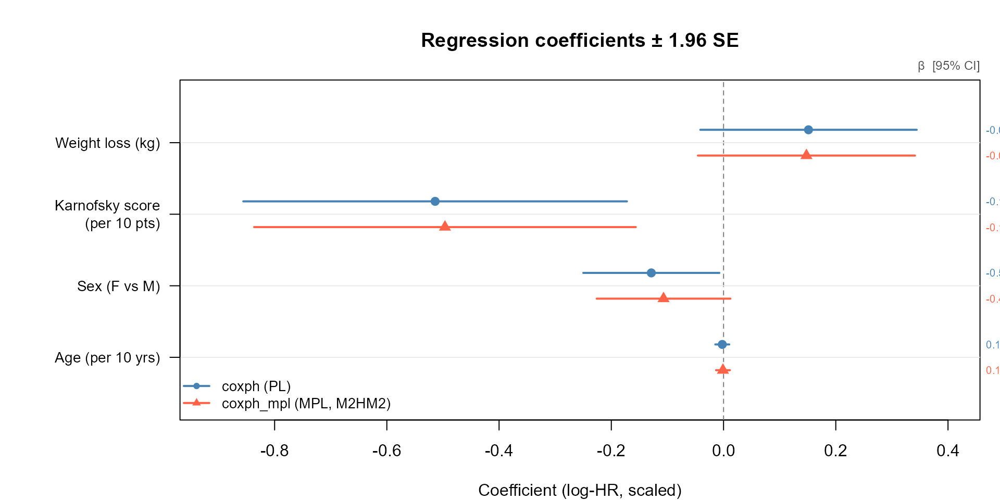
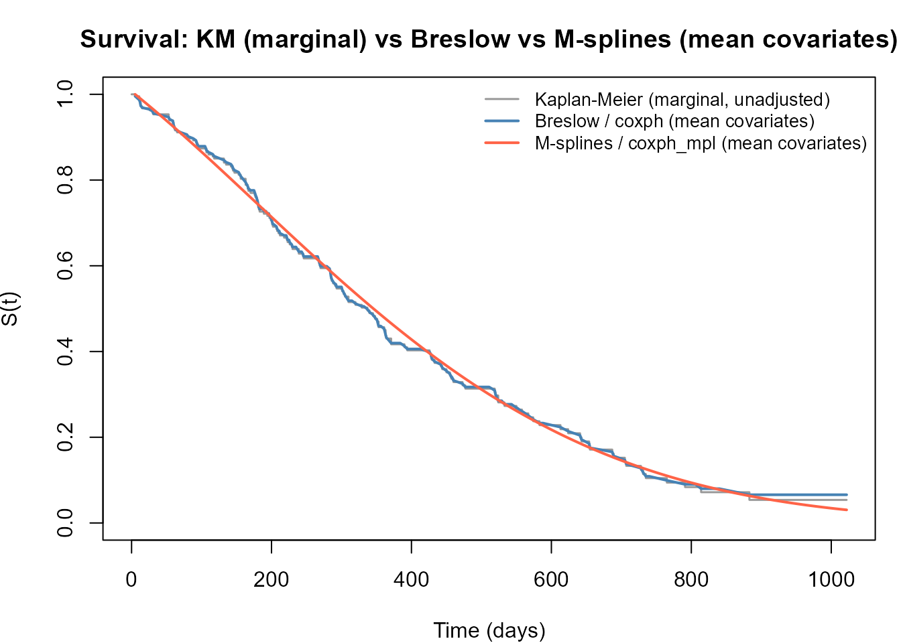

# Comparing coxph and coxph_mpl

## Overview

[`survival::coxph()`](https://rdrr.io/pkg/survival/man/coxph.html)
maximises the *partial likelihood* - a function of regression
coefficients $`\boldsymbol{\beta}`$ only, with the baseline hazard
$`h_0(t)`$ profiled out.
[`survivalMPL::coxph_mpl()`](https://CRAN.R-project.org/package=survivalMPL/reference/coxph_mpl.md)
maximises the *penalised full likelihood*, estimating
$`\boldsymbol{\beta}`$ and $`h_0(t)`$ jointly via a smooth basis
expansion.

For right-censored data with non-informative censoring the two
approaches produce essentially the same $`\hat{\boldsymbol{\beta}}`$ and
standard errors (Ma et al. 2014), while `coxph_mpl` additionally
delivers a smooth, closed-form $`\hat{h}_0(t)`$ that can be plotted and
predicted without additional post-processing.

This tutorial uses the `lung` dataset (`survival` package) - 228
patients with advanced lung cancer, right-censored overall survival to
compare:

1.  Regression coefficient estimates and standard errors.
2.  95 % confidence intervals (forest plot).
3.  Estimated baseline survival: Kaplan–Meier, Breslow (from `coxph`),
    and M-spline (from `coxph_mpl`).

------------------------------------------------------------------------

## Data and model fits

[`library`](https://rdrr.io/r/base/library.html)`(`[`survivalMPL`](https://CRAN.R-project.org/package=survivalMPL)`)`` ``#> Loading required package: survival`` ``#> Loading required package: MASS`` `[`library`](https://rdrr.io/r/base/library.html)`(`[`survival`](https://github.com/therneau/survival)`)`` `` ``lung`` ``<-`` `[`na.omit`](https://rdrr.io/r/stats/na.fail.html)`(``lung``[``, `[`c`](https://rdrr.io/r/base/c.html)`(``"time"``, ``"status"``, ``"age"``, ``"sex"``, ``"ph.karno"``, ``"wt.loss"``)``]``)`` ``f`` ``<-`` `[`Surv`](https://rdrr.io/pkg/survival/man/Surv.html)`(``time``, ``status`` ``==`` ``2``)`` ``~`` ``age`` ``+`` ``sex`` ``+`` ``ph.karno`` ``+`` ``wt.loss`` `` ``# --- partial likelihood (coxph) ---`` ``fit_pl`` ``<-`` `[`coxph`](https://rdrr.io/pkg/survival/man/coxph.html)`(``f``, data ``=`` ``lung``, x ``=`` ``TRUE``)`` `` ``# --- penalised full likelihood, M-splines (coxph_mpl) ---`` ``fit_mpl`` ``<-`` `[`coxph_mpl`](https://CRAN.R-project.org/package=survivalMPL/reference/coxph_mpl.md)`(``f``, data ``=`` ``lung``,`` `` control ``=`` `[`coxph_mpl.control`](https://CRAN.R-project.org/package=survivalMPL/reference/coxph_mpl.control.md)`(`` `` basis ``=`` ``"msplines"``,`` `` n.obs ``=`` `[`sum`](https://rdrr.io/r/base/sum.html)`(``lung``$``status`` ``==`` ``2``)``,`` `` max.iter ``=`` `[`c`](https://rdrr.io/r/base/c.html)`(``150``, ``7.5e4``, ``1e6``)`` `` ``)`` ``)`

------------------------------------------------------------------------

## Regression coefficients and standard errors

`beta_pl`` ``<-`` `[`coef`](https://rdrr.io/r/stats/coef.html)`(``fit_pl``)`` ``se_pl`` ``<-`` `[`sqrt`](https://rdrr.io/r/base/MathFun.html)`(`[`diag`](https://rdrr.io/r/base/diag.html)`(`[`vcov`](https://rdrr.io/r/stats/vcov.html)`(``fit_pl``)``)``)`` `` ``beta_mpl`` ``<-`` `[`coef`](https://rdrr.io/r/stats/coef.html)`(``fit_mpl``)`` ``se_mpl`` ``<-`` ``fit_mpl``$``se``$``Beta``$``M2HM2`` `` ``row_labels`` ``<-`` `[`c`](https://rdrr.io/r/base/c.html)`(`` `` age ``=`` ``"Age (per year)^a^"``,`` `` sex ``=`` ``"Sex"``,`` `` ph.karno ``=`` ``"Karnofsky score (per point)^a^"``,`` `` wt.loss ``=`` ``"Weight loss (kg)"`` ``)`` `` ``tab`` ``<-`` `[`data.frame`](https://rdrr.io/r/base/data.frame.html)`(`` `` Covariate ``=`` ``row_labels``[`[`names`](https://rdrr.io/r/base/names.html)`(``beta_pl``)``]``,`` ```  `PL β`  ```=`` `[`round`](https://rdrr.io/r/base/Round.html)`(``beta_pl``, ``4``)``,`` ```  `PL SE`  ```=`` `[`round`](https://rdrr.io/r/base/Round.html)`(``se_pl``, ``4``)``,`` ```  `MPL β`  ```=`` `[`round`](https://rdrr.io/r/base/Round.html)`(``beta_mpl``, ``4``)``,`` ```  `MPL SE`  ```=`` `[`round`](https://rdrr.io/r/base/Round.html)`(``se_mpl``, ``4``)``,`` ```  `Δβ`  ```=`` `[`round`](https://rdrr.io/r/base/Round.html)`(``beta_mpl`` ``-`` ``beta_pl``, ``4``)``,`` `` check.names ``=`` ``FALSE``,`` `` row.names ``=`` ``NULL`` ``)`` ``knitr``::`[`kable`](https://rdrr.io/pkg/knitr/man/kable.html)`(``tab``, align ``=`` ``"lrrrrr"``,`` `` caption ``=`` ``"^a^ The forest plot rescales these covariates to per-10-unit changes."``)`

| Covariate                       |    PL β |  PL SE |   MPL β | MPL SE |      Δβ |
|:--------------------------------|--------:|-------:|--------:|-------:|--------:|
| Age (per year)^(a)              |  0.0151 | 0.0098 |  0.0148 | 0.0099 | -0.0004 |
| Sex                             | -0.5140 | 0.1744 | -0.4964 | 0.1735 |  0.0176 |
| Karnofsky score (per point)^(a) | -0.0129 | 0.0062 | -0.0107 | 0.0061 |  0.0022 |
| Weight loss (kg)                | -0.0022 | 0.0064 | -0.0010 | 0.0063 |  0.0012 |

^(a) The forest plot rescales these covariates to per-10-unit changes.
{.table style="width:100%;"}

The estimates agree closely: the full-likelihood approach recovers the
same regression signal as partial likelihood, with near-identical
standard errors. The `MPL SE` reported here uses the sandwich variance
estimator for a fixed smoothing parameter derived in Ma et al. (2014)
(equation 29), accessed via `se = "M2HM2"` in the package.

------------------------------------------------------------------------

## Forest plot



------------------------------------------------------------------------

## Baseline survival comparison

Three survival estimators are overlaid:

- **Kaplan–Meier** - nonparametric marginal estimate, no covariate
  adjustment. Serves as a visual reference for the raw data.
- **Breslow** - step-function baseline from `coxph` evaluated at mean
  covariates via
  [`survfit()`](https://rdrr.io/pkg/survival/man/survfit.html). This is
  the standard Cox output for $`\hat{S}(t \mid \bar{\mathbf{x}})`$.
- **M-splines (MPL)** - smooth closed-form estimate from `coxph_mpl`,
  also evaluated at mean covariates.

Breslow and M-splines estimate the same quantity
$`\hat{S}(t \mid \bar{\mathbf{x}})`$ and should track each other
closely. Kaplan–Meier sits apart because it does not adjust for
covariates.



The Breslow estimate is a step function that jumps only at observed
event times. The M-spline estimate is smooth by construction and closely
tracks the Breslow curve, while avoiding the staircase artefacts that
arise from tied or sparse event times. The Kaplan–Meier curve sits above
both because it is not adjusted for covariates - in particular it does
not account for the protective effect of female sex and higher Karnofsky
score at the mean covariate profile.

------------------------------------------------------------------------

## References

Ma, Jun, Stephane Héritier, and Serigne N. Lo. 2014. “On the Maximum
Penalized Likelihood Approach for Proportional Hazard Models with Right
Censored Survival Data.” *Computational Statistics & Data Analysis* 74:
142–56. <https://doi.org/10.1016/j.csda.2014.01.005>.
