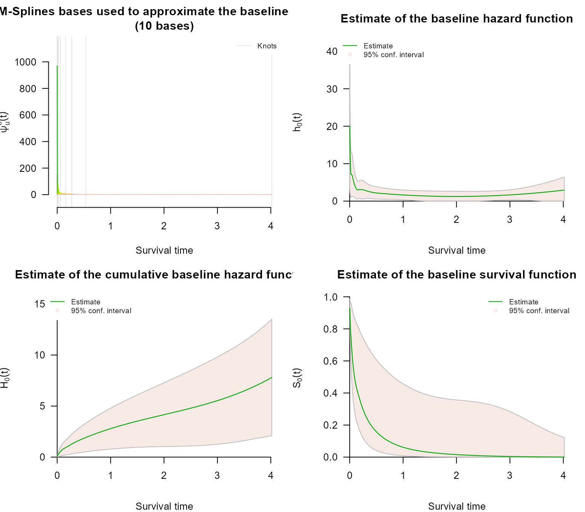
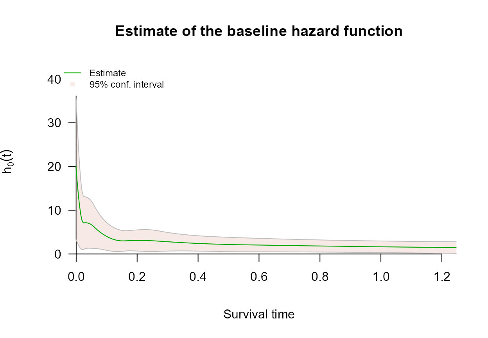
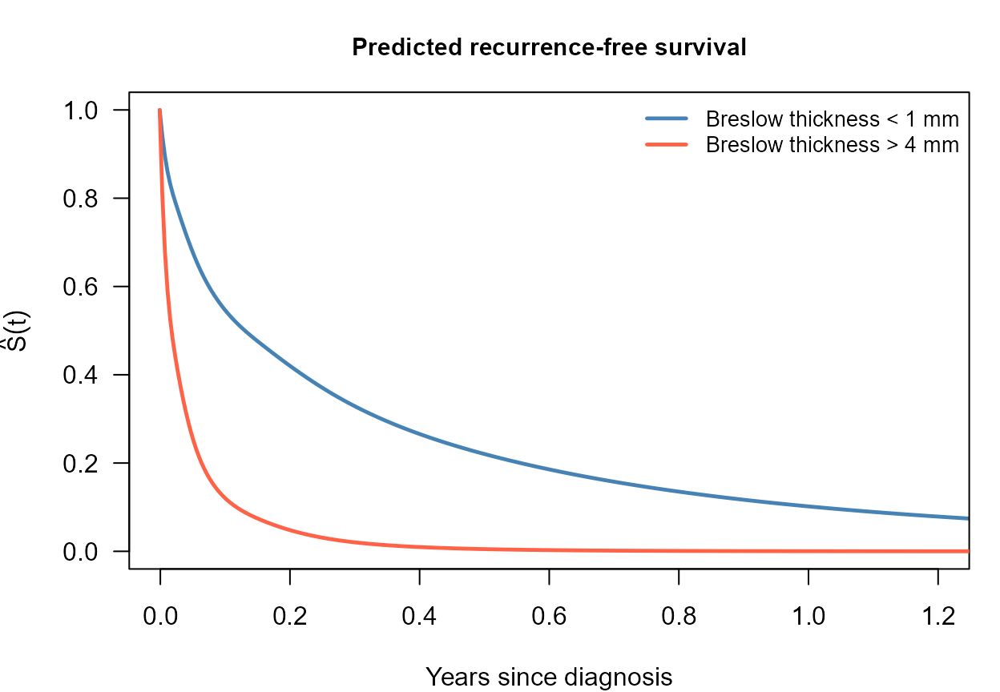

# Interval Censoring with survivalMPL

## Overview

Survival times are *interval censored* when the event is known to have
occurred in an interval $`(t_L, t_R]`$ rather than at an exact time.
This is the normal state of affairs in clinical studies where patients
are examined only periodically: a recurrence found at a follow-up visit
happened at some point since the previous visit, and nothing narrower is
known.

The likelihood contribution is a difference of survivor functions,

``` math
P(t_L < T \leq t_R) = S(t_L) - S(t_R),
```

which requires $`H_0`$ at both endpoints and so cannot be written as a
partial likelihood. `survivalMPL` handles *partly* interval-censored
data: a dataset may mix exact event times with left-, right- and
interval-censored observations, all in one fit. The censoring type is
communicated through `survival::Surv(..., type = "interval2")`, which
infers it from the pair of endpoints:

| Data | Response | Status code |
|----|----|----|
| Exact event at $`t`$ | `Surv(t, t, type = "interval2")` | 1 |
| Interval censored on $`(t_L, t_R]`$ | `Surv(t_L, t_R, type = "interval2")` | 3 |
| Left censored at $`t_R`$ | `Surv(NA, t_R, type = "interval2")` | 2 |
| Right censored at $`t_L`$ | `Surv(t_L, NA, type = "interval2")` | 0 |

`melanoma` stores an unknown lower endpoint as `0` rather than `NA`, and
an unknown upper endpoint as `Inf` rather than `NA`. `Inf` is read as
right censoring exactly like `NA`; `0` is read as an interval starting
at zero, which is the same statement as left censoring since
$`S(0) = 1`$ makes $`S(0) - S(t_R)`$ and $`1 - S(t_R)`$ identical. The
likelihood is unaffected; only the status code
[`Surv()`](https://rdrr.io/pkg/survival/man/Surv.html) reports differs.

This tutorial follows the pseudo-melanoma example of Ma et al. (2024)
(Section 2.11).

------------------------------------------------------------------------

## The `melanoma` data

`melanoma` is a pseudo dataset of time to first local recurrence for
$`n = 300`$ melanoma patients, simulated from the design in Ma et al.
(2024) with a Weibull baseline hazard $`h_0(t) = t^{-1/2}`$. Recurrence
times are interval censored because they are detected at clinic visits.
Covariates are the melanoma **location** at first diagnosis (reference:
head and neck), Breslow **thickness** (reference: $`< 1`$ mm),
**gender** (reference: male), and centred **age** in decades.

[`library`](https://rdrr.io/r/base/library.html)`(`[`survivalMPL`](https://CRAN.R-project.org/package=survivalMPL)`)`` ``#> Loading required package: survival`` ``#> Loading required package: MASS`` `[`library`](https://rdrr.io/r/base/library.html)`(`[`survival`](https://github.com/therneau/survival)`)`` `` `[`data`](https://rdrr.io/r/utils/data.html)`(``melanoma``)`` `` `[`str`](https://rdrr.io/r/utils/str.html)`(``melanoma``)`` ``#> 'data.frame': 300 obs. of 10 variables:`` ``#> $ t_L : num 0.070765 0.314938 0.040158 0.000193 0.643887 ...`` ``#> $ t_R : num 0.070765 0.314938 0.040158 0.000193 0.643887 ...`` ``#> $ Arm : num 0 0 0 0 0 1 0 0 0 0 ...`` ``#> $ Leg : num 0 0 1 1 1 0 0 0 0 1 ...`` ``#> $ Trunk : num 0 1 0 0 0 0 1 0 1 0 ...`` ``#> $ mm1to2 : num 0 0 1 0 0 0 1 1 0 1 ...`` ``#> $ mm2to4 : num 0 0 0 0 0 0 0 0 0 0 ...`` ``#> $ mm4plus : num 1 0 0 1 0 0 0 0 0 0 ...`` ``#> $ Female : int 1 1 0 0 0 0 0 0 0 0 ...`` ``#> $ Age_centred: num -0.3336 1.8786 0.7097 0.7263 -0.0883 ...`

Two thirds of the subjects have an exactly observed recurrence time; the
remaining third is censored, mostly by interval censoring:

[`with`](https://rdrr.io/r/base/with.html)`(``melanoma``, `[`c`](https://rdrr.io/r/base/c.html)`(`` `` exact ``=`` `[`sum`](https://rdrr.io/r/base/sum.html)`(``t_L`` ``==`` ``t_R`` ``&`` `[`is.finite`](https://rdrr.io/r/base/is.finite.html)`(``t_R``)``)``,`` `` interval ``=`` `[`sum`](https://rdrr.io/r/base/sum.html)`(``t_L`` ``>`` ``0`` ``&`` ``t_L`` ``<`` ``t_R`` ``&`` `[`is.finite`](https://rdrr.io/r/base/is.finite.html)`(``t_R``)``)``,`` `` right ``=`` `[`sum`](https://rdrr.io/r/base/sum.html)`(`[`is.infinite`](https://rdrr.io/r/base/is.finite.html)`(``t_R``)``)``,`` `` left ``=`` `[`sum`](https://rdrr.io/r/base/sum.html)`(``t_L`` ``==`` ``0`` ``&`` `[`is.finite`](https://rdrr.io/r/base/is.finite.html)`(``t_R``)``)`` ``)``)`` ``#> exact interval right left `` ``#> 200 58 23 19`` `` `[`table`](https://rdrr.io/r/base/table.html)`(``status ``=`` `[`Surv`](https://rdrr.io/pkg/survival/man/Surv.html)`(``melanoma``$``t_L``, ``melanoma``$``t_R``, type ``=`` ``"interval2"``)``[``, ``3``]``)`` ``#> status`` ``#> 0 1 3 `` ``#> 23 200 77`

The status table counts 77 interval-censored observations rather than
58, because the 19 left-censored rows are stored as intervals
$`(0, t_R]`$ and [`Surv()`](https://rdrr.io/pkg/survival/man/Surv.html)
reports them as such.

The recurrence times are strongly right skewed: 95% of the observed
endpoints fall below one year, but a few reach four.

`endpoints`` ``<-`` `[`c`](https://rdrr.io/r/base/c.html)`(``melanoma``$``t_L``[``melanoma``$``t_L`` ``>`` ``0``]``,`` `` ``melanoma``$``t_R``[`[`is.finite`](https://rdrr.io/r/base/is.finite.html)`(``melanoma``$``t_R``)``]``)`` `[`round`](https://rdrr.io/r/base/Round.html)`(`[`quantile`](https://rdrr.io/r/stats/quantile.html)`(``endpoints``, `[`c`](https://rdrr.io/r/base/c.html)`(``0.5``, ``0.9``, ``0.95``, ``1``)``)``, ``3``)`` ``#> 50% 90% 95% 100% `` ``#> 0.071 0.653 0.938 4.017`

------------------------------------------------------------------------

## Model fit

The call below is the one used in the book: cubic M-splines
(`basis = "m"`) for the baseline hazard, seven quantile knots, a
convergence tolerance of $`10^{-5}`$ and generous iteration caps. The
smoothing value is not set, which leaves it to the automatic smoothing
parameter selection the package performs by default - the marginal
likelihood method of Ma et al. (2024) (Section 2.10), which they single
out as the package’s default behaviour.

`mela_fit`` ``<-`` `[`coxph_mpl`](https://CRAN.R-project.org/package=survivalMPL/reference/coxph_mpl.md)`(`` `` formula ``=`` `[`Surv`](https://rdrr.io/pkg/survival/man/Surv.html)`(``t_L``, ``t_R``, type ``=`` ``"interval2"``)`` ``~`` `` ``Arm`` ``+`` ``Leg`` ``+`` ``Trunk`` ``+`` ``mm1to2`` ``+`` ``mm2to4`` ``+`` ``mm4plus`` ``+`` ``Female`` ``+`` ``Age_centred``,`` `` data ``=`` ``melanoma``,`` `` basis ``=`` ``"m"``, tol ``=`` ``1e-05``, n.knots ``=`` `[`c`](https://rdrr.io/r/base/c.html)`(``7``, ``0``)``,`` `` max.iter ``=`` `[`c`](https://rdrr.io/r/base/c.html)`(``1000``, ``5000``, ``1e+05``)`` ``)`` `` `[`summary`](https://rdrr.io/r/base/summary.html)`(``mela_fit``)`` ``#> `` ``#> coxph_mpl(formula = Surv(t_L, t_R, type = "interval2") ~ Arm + `` ``#> Leg + Trunk + mm1to2 + mm2to4 + mm4plus + Female + Age_centred, `` ``#> data = melanoma, basis = "m", tol = 1e-05, n.knots = c(7, `` ``#> 0), max.iter = c(1000, 5000, 1e+05))`` ``#> `` ``#> -----`` ``#> `` ``#> Cox Proportional Hazards Model Fit Using MPL `` ``#> `` ``#> `` ``#> Penalized log-likelihood : 56.93461`` ``#> Estimated smoothing value : 7.636295e-08`` ``#> Convergence : Yes (17 + 1456 iter.) `` ``#> `` ``#> Data : melanoma`` ``#> Number of obs. : 300`` ``#> Number of events : 200 (66.66667%)`` ``#> Number of cens. : 100 (33.33333%)`` ``#> `` ``#> Regression parameters : Surv(t_L, t_R, type = "interval2") ~ Arm + Leg + Trunk + mm1to2 + mm2to4 + mm4plus + Female + Age_centred`` ``#> Estimate Std. Error z-value Pr(>|z|) `` ``#> Arm -0.478653 0.183003 -2.6155 0.0089086 ** `` ``#> Leg -0.016230 0.174265 -0.0931 0.9257983 `` ``#> Trunk -0.215401 0.152142 -1.4158 0.1568376 `` ``#> mm1to2 -0.031239 0.176290 -0.1772 0.8593476 `` ``#> mm2to4 0.616606 0.181449 3.3982 0.0006782 ***`` ``#> mm4plus 1.254158 0.214963 5.8343 5.402e-09 ***`` ``#> Female -0.167439 0.127052 -1.3179 0.1875449 `` ``#> Age_centred 0.097888 0.049517 1.9769 0.0480573 * `` ``#> ---`` ``#> Signif. codes: 0 '***' 0.001 '**' 0.01 '*' 0.05 '.' 0.1 ' ' 1`` ``#> `` ``#> Baseline hasard parameters approximated using M-Splines :`` ``#> (2 (min/max) + 7 quantile knots + 0 equally spaced knots + 3 (order) - 2 = 10 parameters) `` ``#> 1 2 3 4 5 6 `` ``#> 2.072435e-02 7.548640e-02 1.158956e-01 1.301883e-01 3.630589e-01 2.323992e-01 `` ``#> 7 8 9 10 `` ``#> 5.112513e-01 2.932270e+00 5.372501e-10 3.423429e+00 `` ``#> `` ``#> -----`

The summary reports the fit on the log-hazard-ratio scale, together with
the $`m = 10`$ baseline hazard coefficients
$`\hat{\boldsymbol{\theta}}`$ and the selected smoothing value.
Convergence is reached well inside the iteration caps.

### Hazard ratios

The book presents the same fit as hazard ratios with confidence
intervals and tests (its Table 2.6), which is the form a clinical reader
expects:

`b`` ``<-`` `[`coef`](https://rdrr.io/r/stats/coef.html)`(``mela_fit``)`` ``se`` ``<-`` ``mela_fit``$``se``$``Beta``$``M2QM2`` ``z`` ``<-`` ``b`` ``/`` ``se`` `` ``hr_tab`` ``<-`` `[`data.frame`](https://rdrr.io/r/base/data.frame.html)`(`` `` Covariate ``=`` `[`c`](https://rdrr.io/r/base/c.html)`(``"Arm"``, ``"Leg"``, ``"Trunk"``, ``"1 to 2 mm"``, ``"2 to 4 mm"``,`` `` ``"4 mm and more"``, ``"Female"``, ``"Age (per 10 years)"``)``,`` ```  `HR estimate`  ```=`` `[`round`](https://rdrr.io/r/base/Round.html)`(`[`exp`](https://rdrr.io/r/base/Log.html)`(``b``)``, ``3``)``,`` ```  `95% CI lower`  ```=`` `[`round`](https://rdrr.io/r/base/Round.html)`(`[`exp`](https://rdrr.io/r/base/Log.html)`(``b`` ``-`` `[`qnorm`](https://rdrr.io/r/stats/Normal.html)`(``0.975``)`` ``*`` ``se``)``, ``3``)``,`` ```  `95% CI upper`  ```=`` `[`round`](https://rdrr.io/r/base/Round.html)`(`[`exp`](https://rdrr.io/r/base/Log.html)`(``b`` ``+`` `[`qnorm`](https://rdrr.io/r/stats/Normal.html)`(``0.975``)`` ``*`` ``se``)``, ``3``)``,`` ```  `p-value`  ```=`` `[`format.pval`](https://rdrr.io/r/base/format.pval.html)`(``2`` ``*`` `[`pnorm`](https://rdrr.io/r/stats/Normal.html)`(``-`[`abs`](https://rdrr.io/r/base/MathFun.html)`(``z``)``)``, digits ``=`` ``3``, eps ``=`` ``1e-4``)``,`` `` check.names ``=`` ``FALSE``,`` `` row.names ``=`` ``NULL`` ``)`` `` ``knitr``::`[`kable`](https://rdrr.io/pkg/knitr/man/kable.html)`(``hr_tab``, align ``=`` ``"lrrrr"``)`

| Covariate          | HR estimate | 95% CI lower | 95% CI upper |  p-value |
|:-------------------|------------:|-------------:|-------------:|---------:|
| Arm                |       0.620 |        0.433 |        0.887 | 0.008909 |
| Leg                |       0.984 |        0.699 |        1.384 | 0.925798 |
| Trunk              |       0.806 |        0.598 |        1.086 | 0.156838 |
| 1 to 2 mm          |       0.969 |        0.686 |        1.369 | 0.859348 |
| 2 to 4 mm          |       1.853 |        1.298 |        2.644 | 0.000678 |
| 4 mm and more      |       3.505 |        2.300 |        5.341 | \< 1e-04 |
| Female             |       0.846 |        0.659 |        1.085 | 0.187545 |
| Age (per 10 years) |       1.103 |        1.001 |        1.215 | 0.048057 |

Read against the head-and-neck reference, a melanoma first diagnosed on
the arm carries a significantly lower risk of recurrence, while the leg
and trunk categories are not distinguishable from the reference. Breslow
thickness is the dominant risk factor: relative to tumours under 1 mm,
the hazard is about 1.9 times higher at 2-4 mm and 3.5 times higher
above 4 mm, both with $`p < 0.001`$. A 10-year increase in age raises
the recurrence hazard by about 10%, marginally significant here. Gender
points the same way as in the book - women at lower risk - but does not
reach significance in this sample.

The book’s Table 2.6 reports similar hazard ratios from its own
simulated sample, in which 37% of the recurrence times are exactly
observed. The bundled `melanoma` is generated with two thirds exact
events, so the point estimates are comparable but the confidence
intervals differ, and the trunk and gender effects that are borderline
in the book do not reach significance here. The coefficients used to
generate the data are documented in
[`?melanoma`](https://CRAN.R-project.org/package=survivalMPL/reference/melanoma.md).

## Baseline hazard and survival

[`plot()`](https://rdrr.io/r/graphics/plot.default.html) on the fitted
object gives the basis functions, the baseline hazard, the cumulative
baseline hazard and the baseline survival - the book’s Figure 2.5 is the
second of these:

[`par`](https://rdrr.io/r/graphics/par.html)`(``mfrow ``=`` `[`c`](https://rdrr.io/r/base/c.html)`(``2``, ``2``)``, mar ``=`` `[`c`](https://rdrr.io/r/base/c.html)`(``4``, ``4``, ``3``, ``1``)``)`` `[`plot`](https://rdrr.io/r/graphics/plot.default.html)`(``mela_fit``, ask ``=`` ``FALSE``, cex.main ``=`` ``0.8``)`



At baseline covariate values the estimated hazard of recurrence falls
steeply and monotonically away from the origin and then flattens close
to a constant, which is the behaviour the true $`h_0(t) = t^{-1/2}`$
has. The slight lift at the extreme right, past four years, rests on a
handful of observations and is not supported by the confidence band.

Because the recurrence times are so skewed, everything of interest is
squeezed into the left-hand tenth of the panel. `xlim` narrows the
displayed range; the fit itself, and the knots, are unchanged:

[`plot`](https://rdrr.io/r/graphics/plot.default.html)`(``mela_fit``, which ``=`` ``2``, ask ``=`` ``FALSE``, cex.main ``=`` ``0.9``, xlim ``=`` `[`c`](https://rdrr.io/r/base/c.html)`(``0``, ``1.2``)``)`



Beyond the book’s example,
[`predict()`](https://rdrr.io/r/stats/predict.html) turns the same fit
into absolute survival for a named covariate profile. Contrasting the
thinnest and thickest tumours shows the size of the thickness effect on
that scale:

`i_thin`` ``<-`` `[`which`](https://rdrr.io/r/base/which.html)`(``melanoma``$``mm1to2`` ``==`` ``0`` ``&`` ``melanoma``$``mm2to4`` ``==`` ``0`` ``&`` `` ``melanoma``$``mm4plus`` ``==`` ``0``)``[``1``]`` ``i_thick`` ``<-`` `[`which`](https://rdrr.io/r/base/which.html)`(``melanoma``$``mm4plus`` ``==`` ``1``)``[``1``]`` `` ``p_thin`` ``<-`` `[`predict`](https://rdrr.io/r/stats/predict.html)`(``mela_fit``, type ``=`` ``"survival"``, i ``=`` ``i_thin``)`` ``p_thick`` ``<-`` `[`predict`](https://rdrr.io/r/stats/predict.html)`(``mela_fit``, type ``=`` ``"survival"``, i ``=`` ``i_thick``)`` `` `[`par`](https://rdrr.io/r/graphics/par.html)`(``mar ``=`` `[`c`](https://rdrr.io/r/base/c.html)`(``4``, ``4.2``, ``3``, ``1``)``)`` `[`plot`](https://rdrr.io/r/graphics/plot.default.html)`(``p_thin``$``time``, ``p_thin``$``survival``, type ``=`` ``"l"``, col ``=`` ``"steelblue"``, lwd ``=`` ``2.4``,`` `` xlim ``=`` `[`c`](https://rdrr.io/r/base/c.html)`(``0``, ``1.2``)``, ylim ``=`` `[`c`](https://rdrr.io/r/base/c.html)`(``0``, ``1``)``, las ``=`` ``1``,`` `` xlab ``=`` ``"Years since diagnosis"``, ylab ``=`` `[`expression`](https://rdrr.io/r/base/expression.html)`(`[`hat`](https://rdrr.io/r/stats/influence.measures.html)`(``S``)``(``t``)``)``,`` `` main ``=`` ``"Predicted recurrence-free survival"``, cex.main ``=`` ``0.95``)`` `[`lines`](https://rdrr.io/r/graphics/lines.html)`(``p_thick``$``time``, ``p_thick``$``survival``, col ``=`` ``"tomato"``, lwd ``=`` ``2.4``)`` `[`legend`](https://rdrr.io/r/graphics/legend.html)`(``"topright"``, legend ``=`` `[`c`](https://rdrr.io/r/base/c.html)`(``"Breslow thickness < 1 mm"``, ``"Breslow thickness > 4 mm"``)``,`` `` col ``=`` `[`c`](https://rdrr.io/r/base/c.html)`(``"steelblue"``, ``"tomato"``)``, lwd ``=`` ``2.4``, bty ``=`` ``"n"``, cex ``=`` ``0.85``)`



------------------------------------------------------------------------

## Next steps

- **Left Censoring** covers the boundary case of interval censoring,
  where the lower endpoint is unknown, on a dataset with no
  interval-censored observations at all.
- **Right Censoring** covers the standard scheme and the
  `Surv(time, status)` response.
- **Control Parameters** explains `basis`, `n.knots`, `tol` and
  `max.iter`, the settings the fit above changes from their defaults.
- **Basis Functions for the Baseline Hazard** explains the four choices
  for $`\psi_u`$, including the `"msplines"` basis used above.

## References

Ma, Jun, Annabel Webb, and Harold Malcolm Hudson. 2024. *Likelihood
Methods in Survival Analysis: With R Examples*. 1st ed. Chapman;
Hall/CRC. <https://doi.org/10.1201/9781351109710>.
