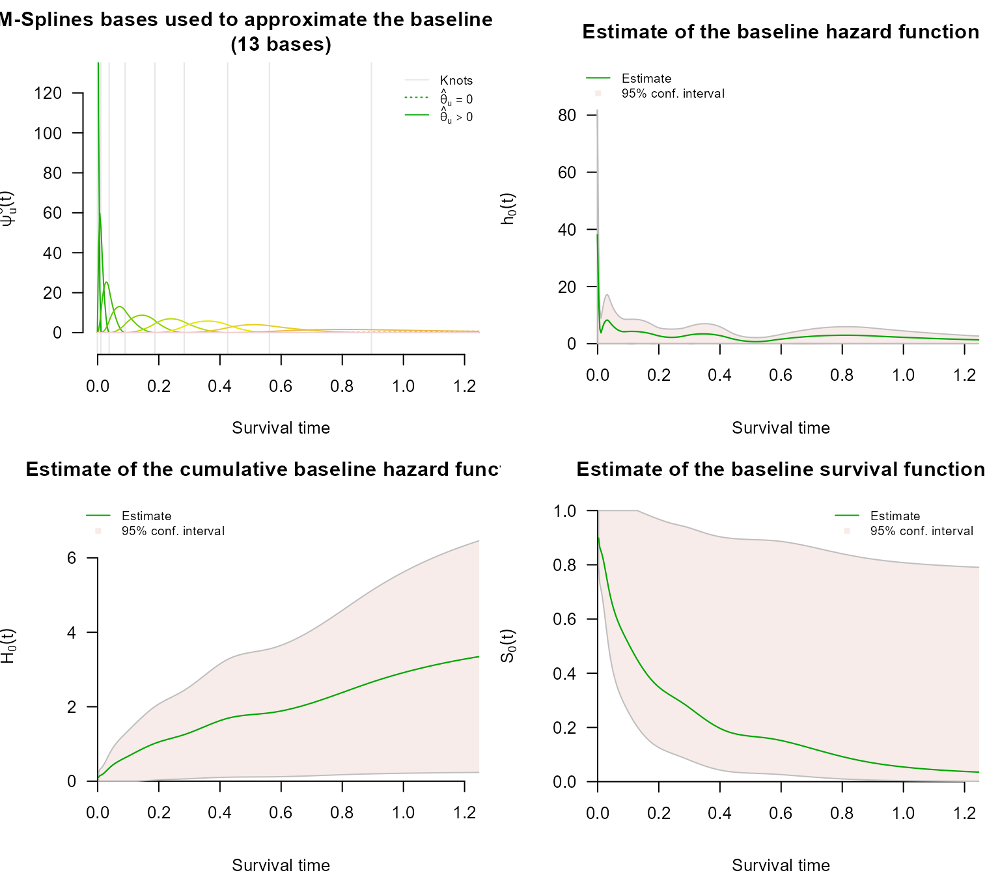
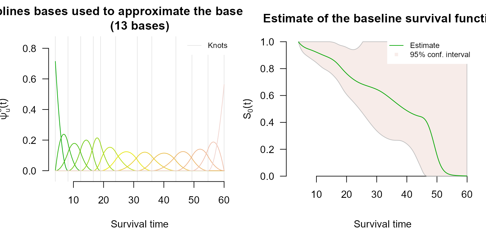

# Left Censoring with survivalMPL

## Overview

A survival time is *left censored* when the event is known to have
happened already by the time the subject is first examined, but not
when. All that is recorded is an upper bound $`t_R`$: the event occurred
somewhere in $`(0, t_R]`$. This arises whenever the outcome is detected
by inspection rather than observed as it happens: a tumour already
present at the first scan, seroconversion already complete at enrolment,
a milestone already reached at the first assessment.

The likelihood contribution is the distribution function rather than the
survivor function,

``` math
P(T \leq t_R) = 1 - S(t_R) = 1 - \exp\bigl\{-H_0(t_R)e^{\mathbf{x}^T\boldsymbol{\beta}}\bigr\},
```

which the partial likelihood cannot accommodate. Because
[`coxph_mpl()`](https://CRAN.R-project.org/package=survivalMPL/reference/coxph_mpl.md)
estimates $`H_0`$ explicitly, left-censored observations are handled
directly, and may be mixed freely with exact events and right- and
interval-censored observations in the same fit.

## Encoding left-censored observations

Left censoring uses the `type = "interval2"` response, with `NA` in
place of the unknown lower endpoint:

[`library`](https://rdrr.io/r/base/library.html)`(`[`survivalMPL`](https://CRAN.R-project.org/package=survivalMPL)`)`` ``#> Loading required package: survival`` ``#> Loading required package: MASS`` `[`library`](https://rdrr.io/r/base/library.html)`(`[`survival`](https://github.com/therneau/survival)`)`` `` `[`Surv`](https://rdrr.io/pkg/survival/man/Surv.html)`(`[`c`](https://rdrr.io/r/base/c.html)`(``NA``, ``2``, ``3``, ``5``)``, `[`c`](https://rdrr.io/r/base/c.html)`(``7``, ``4``, ``NA``, ``5``)``, type ``=`` ``"interval2"``)`` ``#> [1] 7- [2, 4] 3+ 5`

The four observations above are, in order: left censored at 7 (`7-`),
interval censored on $`(2, 4]`$, right censored at 3 (`3+`), and an
exact event at 5. [`Surv()`](https://rdrr.io/pkg/survival/man/Surv.html)
records the distinction in its status code, and
[`coxph_mpl()`](https://CRAN.R-project.org/package=survivalMPL/reference/coxph_mpl.md)
dispatches on that code:

`s`` ``<-`` `[`Surv`](https://rdrr.io/pkg/survival/man/Surv.html)`(`[`c`](https://rdrr.io/r/base/c.html)`(``NA``, ``2``, ``3``, ``5``)``, `[`c`](https://rdrr.io/r/base/c.html)`(``7``, ``4``, ``NA``, ``5``)``, type ``=`` ``"interval2"``)`` `[`data.frame`](https://rdrr.io/r/base/data.frame.html)`(``status ``=`` ``s``[``, ``3``]``,`` `` meaning ``=`` `[`c`](https://rdrr.io/r/base/c.html)`(``"left censored"``, ``"interval censored"``,`` `` ``"right censored"``, ``"exact event"``)``)`` ``#> status meaning`` ``#> 1 2 left censored`` ``#> 2 3 interval censored`` ``#> 3 0 right censored`` ``#> 4 1 exact event`

Note that `NA` here is *information*, not missingness: these rows are
kept, not dropped by `na.action`.

------------------------------------------------------------------------

## Example: pseudo-melanoma data

The bundled `melanoma` data (time to first local recurrence,
$`n = 300`$, simulated) is partly interval censored and contains all
four observation types. Recurrences already present at the first
assessment are recorded with a lower endpoint of zero:

[`data`](https://rdrr.io/r/utils/data.html)`(``melanoma``)`` `` `[`with`](https://rdrr.io/r/base/with.html)`(``melanoma``, `[`c`](https://rdrr.io/r/base/c.html)`(`` `` exact ``=`` `[`sum`](https://rdrr.io/r/base/sum.html)`(``t_L`` ``==`` ``t_R`` ``&`` `[`is.finite`](https://rdrr.io/r/base/is.finite.html)`(``t_R``)``)``,`` `` left ``=`` `[`sum`](https://rdrr.io/r/base/sum.html)`(``t_L`` ``==`` ``0`` ``&`` `[`is.finite`](https://rdrr.io/r/base/is.finite.html)`(``t_R``)``)``,`` `` interval ``=`` `[`sum`](https://rdrr.io/r/base/sum.html)`(``t_L`` ``>`` ``0`` ``&`` ``t_L`` ``<`` ``t_R`` ``&`` `[`is.finite`](https://rdrr.io/r/base/is.finite.html)`(``t_R``)``)``,`` `` right ``=`` `[`sum`](https://rdrr.io/r/base/sum.html)`(`[`is.infinite`](https://rdrr.io/r/base/is.finite.html)`(``t_R``)``)`` ``)``)`` ``#> exact left interval right `` ``#> 117 132 35 16`

So 132 of the 300 subjects (44%) are left censored.

### Two equivalent encodings

Recording a left-censored observation as the interval $`(0, t_R]`$ and
recording it as left censored at $`t_R`$ describe the same event, since
$`S(0) = 1`$ makes $`S(0) - S(t_R)`$ and $`1 - S(t_R)`$ identical. The
data ship in the first form; the second is obtained by replacing the
zero lower endpoints with `NA`:

`mel`` ``<-`` ``melanoma`` ``mel``$``t_L2`` ``<-`` `[`ifelse`](https://rdrr.io/r/base/ifelse.html)`(``melanoma``$``t_L`` ``==`` ``0``, ``NA``, ``melanoma``$``t_L``)`` ``mel``$``t_R2`` ``<-`` `[`ifelse`](https://rdrr.io/r/base/ifelse.html)`(`[`is.finite`](https://rdrr.io/r/base/is.finite.html)`(``melanoma``$``t_R``)``, ``melanoma``$``t_R``, ``NA``)`` `` `[`rbind`](https://rdrr.io/r/base/cbind.html)`(`` ```  `as interval (0, t_R]`  ```=`` `[`table`](https://rdrr.io/r/base/table.html)`(`[`factor`](https://rdrr.io/r/base/factor.html)`(`[`Surv`](https://rdrr.io/pkg/survival/man/Surv.html)`(``melanoma``$``t_L``, ``melanoma``$``t_R``,`` `` type ``=`` ``"interval2"``)``[``, ``3``]``,`` `` levels ``=`` ``0``:``3``)``)``,`` ```  `as left censored`  ```=`` `[`table`](https://rdrr.io/r/base/table.html)`(`[`factor`](https://rdrr.io/r/base/factor.html)`(`[`Surv`](https://rdrr.io/pkg/survival/man/Surv.html)`(``mel``$``t_L2``, ``mel``$``t_R2``,`` `` type ``=`` ``"interval2"``)``[``, ``3``]``,`` `` levels ``=`` ``0``:``3``)``)`` ``)`` ``#> 0 1 2 3`` ``#> as interval (0, t_R] 16 117 0 167`` ``#> as left censored 16 117 132 35`

The 132 observations move from status `3` (interval) to status `2`
(left), and fitting either version gives the same answer:

`ctrl`` ``<-`` `[`coxph_mpl.control`](https://CRAN.R-project.org/package=survivalMPL/reference/coxph_mpl.control.md)`(`` `` basis ``=`` ``"msplines"``,`` `` n.obs ``=`` `[`sum`](https://rdrr.io/r/base/sum.html)`(``melanoma``$``t_L`` ``==`` ``melanoma``$``t_R`` ``&`` `[`is.finite`](https://rdrr.io/r/base/is.finite.html)`(``melanoma``$``t_R``)``)``,`` `` smooth ``=`` ``0``,`` `` max.iter ``=`` `[`c`](https://rdrr.io/r/base/c.html)`(``40``, ``2e4``, ``5e4``)`` ``)`` `` ``fit_interval`` ``<-`` `[`coxph_mpl`](https://CRAN.R-project.org/package=survivalMPL/reference/coxph_mpl.md)`(`` `` `[`Surv`](https://rdrr.io/pkg/survival/man/Surv.html)`(``t_L``, ``t_R``, type ``=`` ``"interval2"``)`` ``~`` `` ``Arm`` ``+`` ``Leg`` ``+`` ``Trunk`` ``+`` ``mm1to2`` ``+`` ``mm2to4`` ``+`` ``mm4plus`` ``+`` ``Female`` ``+`` ``Age_centred``,`` `` data ``=`` ``melanoma``, control ``=`` ``ctrl``)`` `` ``fit_left`` ``<-`` `[`coxph_mpl`](https://CRAN.R-project.org/package=survivalMPL/reference/coxph_mpl.md)`(`` `` `[`Surv`](https://rdrr.io/pkg/survival/man/Surv.html)`(``t_L2``, ``t_R2``, type ``=`` ``"interval2"``)`` ``~`` `` ``Arm`` ``+`` ``Leg`` ``+`` ``Trunk`` ``+`` ``mm1to2`` ``+`` ``mm2to4`` ``+`` ``mm4plus`` ``+`` ``Female`` ``+`` ``Age_centred``,`` `` data ``=`` ``mel``, control ``=`` ``ctrl``)`` `` `[`round`](https://rdrr.io/r/base/Round.html)`(`[`cbind`](https://rdrr.io/r/base/cbind.html)`(``` `interval (0, t_R]`  ```=`` `[`coef`](https://rdrr.io/r/stats/coef.html)`(``fit_interval``)``,`` ```  `left censored`  ```=`` `[`coef`](https://rdrr.io/r/stats/coef.html)`(``fit_left``)``)``, ``3``)`` ``#> interval (0, t_R] left censored`` ``#> Arm -0.562 -0.576`` ``#> Leg -0.087 -0.107`` ``#> Trunk -0.239 -0.247`` ``#> mm1to2 0.029 0.035`` ``#> mm2to4 0.625 0.625`` ``#> mm4plus 1.436 1.417`` ``#> Female -0.089 -0.091`` ``#> Age_centred 0.111 0.113`

The two columns agree to about 0.02. They are not bit-identical because
the knot positions are quantiles of the observed endpoint times, and the
two encodings present slightly different sets of endpoints, not because
the likelihoods differ.

### Inspecting the fit

[`summary`](https://rdrr.io/r/base/summary.html)`(``fit_left``)`` ``#> `` ``#> coxph_mpl(formula = Surv(t_L2, t_R2, type = "interval2") ~ Arm + `` ``#> Leg + Trunk + mm1to2 + mm2to4 + mm4plus + Female + Age_centred, `` ``#> data = mel, control = ctrl)`` ``#> `` ``#> -----`` ``#> `` ``#> Cox Proportional Hazards Model Fit Using MPL `` ``#> `` ``#> `` ``#> Penalized log-likelihood : -18.53554`` ``#> Fixed smoothing value : 0`` ``#> Convergence : Yes (233 iter.) `` ``#> `` ``#> Data : mel`` ``#> Number of obs. : 300`` ``#> Number of events : 117 (39%)`` ``#> Number of cens. : 183 (61%)`` ``#> `` ``#> Regression parameters : Surv(t_L2, t_R2, type = "interval2") ~ Arm + Leg + Trunk + mm1to2 + mm2to4 + mm4plus + Female + Age_centred`` ``#> Estimate Std. Error z-value Pr(>|z|) `` ``#> Arm -0.575622 0.195228 -2.9485 0.003194 ** `` ``#> Leg -0.107484 0.171015 -0.6285 0.529670 `` ``#> Trunk -0.247131 0.155375 -1.5906 0.111710 `` ``#> mm1to2 0.034775 0.189120 0.1839 0.854108 `` ``#> mm2to4 0.624525 0.203372 3.0709 0.002135 ** `` ``#> mm4plus 1.416740 0.243783 5.8115 6.192e-09 ***`` ``#> Female -0.090508 0.131017 -0.6908 0.489684 `` ``#> Age_centred 0.113420 0.048858 2.3214 0.020263 * `` ``#> ---`` ``#> Signif. codes: 0 '***' 0.001 '**' 0.01 '*' 0.05 '.' 0.1 ' ' 1`` ``#> `` ``#> Baseline hasard parameters approximated using M-Splines :`` ``#> (2 (min/max) + 8 quantile knots + 2 equally spaced knots + 3 (order) - 2 = 13 parameters) `` ``#> 1 2 3 4 5 6 `` ``#> 1.436162e-01 9.825969e-03 2.966489e-01 2.336807e-01 3.805598e-01 1.736077e-01 `` ``#> 7 8 9 11 13 `` ``#> 5.493765e-01 1.773562e-09 1.817603e+00 2.486888e+00 2.037200e+00 `` ``#> `` ``#> -----`

The recurrence times are strongly right-skewed: 95% of the observed
endpoints fall below 1.1 years, but a few reach 4. Over the full range
every feature of the fit is squeezed into the left-hand tenth of the
panel, so we narrow the displayed range with `xlim`. This affects only
what is drawn; the fit itself, and the knots, are unchanged.

[`par`](https://rdrr.io/r/graphics/par.html)`(``mfrow ``=`` `[`c`](https://rdrr.io/r/base/c.html)`(``2``, ``2``)``, mar ``=`` `[`c`](https://rdrr.io/r/base/c.html)`(``4``, ``4``, ``3``, ``1``)``)`` `[`plot`](https://rdrr.io/r/graphics/plot.default.html)`(``fit_left``, ask ``=`` ``FALSE``, cex.main ``=`` ``0.8``, xlim ``=`` `[`c`](https://rdrr.io/r/base/c.html)`(``0``, ``1.2``)``)`



The M-spline basis places most of its knots where the events are, so the
first panel is dense near zero. The wide confidence band on $`S_0(t)`$
reflects how little information the left-censored observations carry
individually: each one says only that the event happened at some point
before $`t_R`$.

------------------------------------------------------------------------

## Example: `bcos2`

The breast cosmesis data are mostly interval censored, but include a
handful of genuinely left-censored subjects, already coded with `NA`:

[`data`](https://rdrr.io/r/utils/data.html)`(``bcos2``)`` `` `[`table`](https://rdrr.io/r/base/table.html)`(``status ``=`` `[`Surv`](https://rdrr.io/pkg/survival/man/Surv.html)`(``bcos2``$``left``, ``bcos2``$``right``, type ``=`` ``"interval2"``)``[``, ``3``]``)`` ``#> status`` ``#> 0 2 3 `` ``#> 38 5 51`` `[`head`](https://rdrr.io/r/utils/head.html)`(``bcos2``[`[`is.na`](https://rdrr.io/r/base/NA.html)`(``bcos2``$``left``)``, ``]``)`` ``#> left right treatment`` ``#> 3 NA 7 Rad`` ``#> 10 NA 8 Rad`` ``#> 33 NA 5 Rad`` ``#> 48 NA 22 RadChem`` ``#> 63 NA 5 RadChem`

Status `2` marks the left-censored rows; no special handling is needed:

`fit_bcos`` ``<-`` `[`coxph_mpl`](https://CRAN.R-project.org/package=survivalMPL/reference/coxph_mpl.md)`(`` `` `[`Surv`](https://rdrr.io/pkg/survival/man/Surv.html)`(``left``, ``right``, type ``=`` ``"interval2"``)`` ``~`` ``treatment``,`` `` data ``=`` ``bcos2``,`` `` control ``=`` `[`coxph_mpl.control`](https://CRAN.R-project.org/package=survivalMPL/reference/coxph_mpl.control.md)`(`` `` basis ``=`` ``"msplines"``,`` `` n.obs ``=`` `[`nrow`](https://rdrr.io/r/base/nrow.html)`(``bcos2``)``,`` `` max.iter ``=`` `[`c`](https://rdrr.io/r/base/c.html)`(``40``, ``2000``, ``4000``)``,`` `` smooth ``=`` ``0`` `` ``)`` ``)`` `` `[`summary`](https://rdrr.io/r/base/summary.html)`(``fit_bcos``)`` ``#> `` ``#> coxph_mpl(formula = Surv(left, right, type = "interval2") ~ treatment, `` ``#> data = bcos2, control = coxph_mpl.control(basis = "msplines", `` ``#> n.obs = nrow(bcos2), max.iter = c(40, 2000, 4000), smooth = 0))`` ``#> `` ``#> -----`` ``#> `` ``#> Cox Proportional Hazards Model Fit Using MPL `` ``#> `` ``#> `` ``#> Penalized log-likelihood : -140.254`` ``#> Fixed smoothing value : 0`` ``#> Convergence : NO `` ``#> `` ``#> Data : bcos2`` ``#> Number of obs. : 94`` ``#> Number of events : 0 ( 0%)`` ``#> Number of cens. : 94 (100%)`` ``#> `` ``#> Regression parameters : Surv(left, right, type = "interval2") ~ treatment`` ``#> Estimate Std. Error z-value Pr(>|z|) `` ``#> treatmentRadChem 0.87311 0.33348 2.6181 0.008841 **`` ``#> ---`` ``#> Signif. codes: 0 '***' 0.001 '**' 0.01 '*' 0.05 '.' 0.1 ' ' 1`` ``#> `` ``#> Baseline hasard parameters approximated using M-Splines :`` ``#> (2 (min/max) + 8 quantile knots + 2 equally spaced knots + 3 (order) - 2 = 13 parameters) `` ``#> 1 2 3 4 5 6 `` ``#> 4.284005e-02 1.608827e-02 5.030707e-02 3.116483e-02 1.317693e-01 1.213149e-01 `` ``#> 7 8 9 10 11 12 `` ``#> 2.396608e-02 2.067590e-01 2.068148e-01 6.402848e-10 4.310156e+00 6.628441e-01 `` ``#> 13 `` ``#> 6.628441e-01 `` ``#> `` ``#> -----`

The same [`plot()`](https://rdrr.io/r/graphics/plot.default.html) method
applies. Here we show the basis functions and the estimated baseline
survival:

[`par`](https://rdrr.io/r/graphics/par.html)`(``mfrow ``=`` `[`c`](https://rdrr.io/r/base/c.html)`(``1``, ``2``)``, mar ``=`` `[`c`](https://rdrr.io/r/base/c.html)`(``4``, ``4``, ``3``, ``1``)``)`` `[`plot`](https://rdrr.io/r/graphics/plot.default.html)`(``fit_bcos``, ask ``=`` ``FALSE``, which ``=`` `[`c`](https://rdrr.io/r/base/c.html)`(``1``, ``4``)``, cex.main ``=`` ``0.85``)`



The hazard and cumulative hazard panels (`which = 2:3`) are omitted for
this fit rather than shown: with no exact event times and very little
information in the last knot interval, the delta-method standard error
of the final $`\hat\theta_u`$ is enormous, and the resulting confidence
band dominates the vertical scale to the point where the estimate itself
is invisible. The survival panel is unaffected because it is bounded in
$`[0, 1]`$.

------------------------------------------------------------------------

## Next steps

- **Interval Censoring** covers the general partly interval-censored
  case, of which left censoring is the boundary instance.
- **Right Censoring** covers the standard scheme and left truncation.
- **Basis Functions for the Baseline Hazard** explains the choice of
  $`\psi_u`$; because $`H_0(t_R)`$ enters the left-censored likelihood
  directly, that choice matters more here than for right-censored data
  alone.
