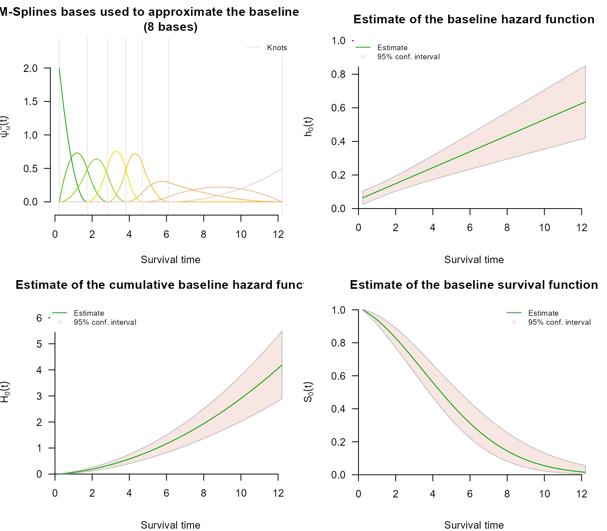
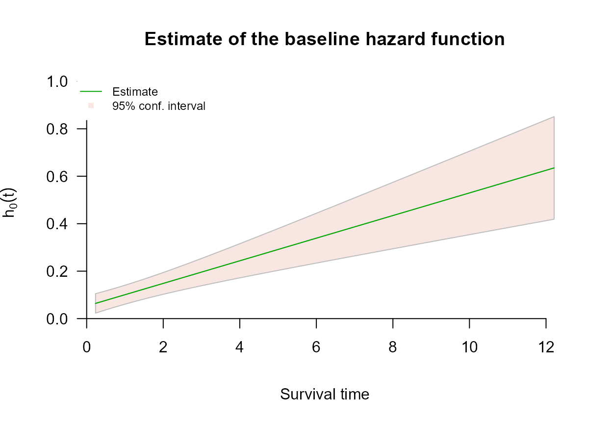
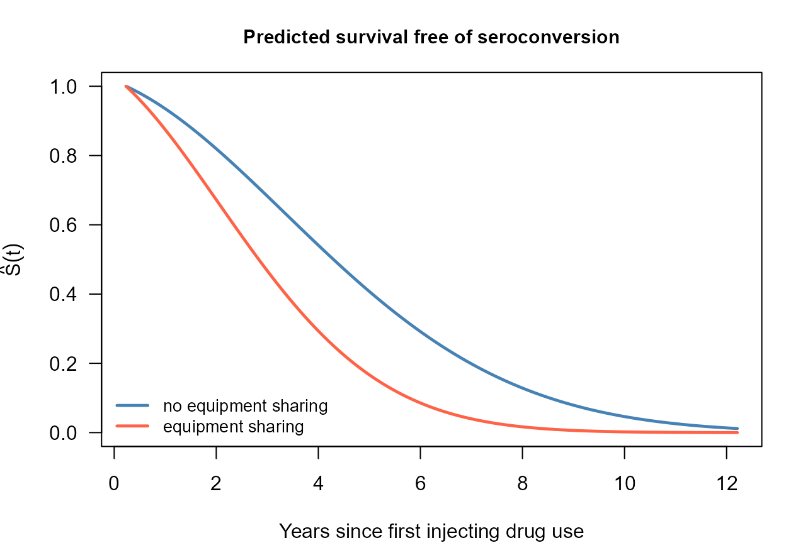

# Left Censoring with survivalMPL

## Overview

A survival time is *left censored* when the event is known to have
happened already by the time the subject is first examined, but not
when. All that is recorded is an upper bound $`t_R`$: the event occurred
somewhere in $`(0, t_R]`$. This arises whenever the outcome is detected
by inspection rather than observed as it happens - a tumour already
present at the first scan, seroconversion already complete at enrolment,
a milestone already reached at the first assessment.

The likelihood contribution is the distribution function rather than the
survivor function,

``` math
P(T \leq t_R) = 1 - S(t_R) = 1 - \exp\bigl\{-H_0(t_R)e^{\mathbf{x}^T\boldsymbol{\beta}}\bigr\},
```

which the partial likelihood cannot accommodate: it needs a risk set at
a known event time, and a left-censored subject supplies neither.
Because
[`coxph_mpl()`](https://CRAN.R-project.org/package=survivalMPL/reference/coxph_mpl.md)
estimates $`H_0`$ explicitly, left-censored observations enter the
likelihood directly, and may be mixed freely with exact events and
right- and interval-censored observations in the same fit.

## Encoding left-censored observations

Left censoring uses the `type = "interval2"` response, with `NA` in
place of the unknown lower endpoint:

[`library`](https://rdrr.io/r/base/library.html)`(`[`survivalMPL`](https://CRAN.R-project.org/package=survivalMPL)`)`` ``#> Loading required package: survival`` ``#> Loading required package: MASS`` `[`library`](https://rdrr.io/r/base/library.html)`(`[`survival`](https://github.com/therneau/survival)`)`` `` `[`Surv`](https://rdrr.io/pkg/survival/man/Surv.html)`(`[`c`](https://rdrr.io/r/base/c.html)`(``NA``, ``2``, ``3``, ``5``)``, `[`c`](https://rdrr.io/r/base/c.html)`(``7``, ``4``, ``NA``, ``5``)``, type ``=`` ``"interval2"``)`` ``#> [1] 7- [2, 4] 3+ 5`

The four observations above are, in order: left censored at 7 (`7-`),
interval censored on $`(2, 4]`$, right censored at 3 (`3+`), and an
exact event at 5. [`Surv()`](https://rdrr.io/pkg/survival/man/Surv.html)
records the distinction in its status code, and
[`coxph_mpl()`](https://CRAN.R-project.org/package=survivalMPL/reference/coxph_mpl.md)
dispatches on that code:

`s`` ``<-`` `[`Surv`](https://rdrr.io/pkg/survival/man/Surv.html)`(`[`c`](https://rdrr.io/r/base/c.html)`(``NA``, ``2``, ``3``, ``5``)``, `[`c`](https://rdrr.io/r/base/c.html)`(``7``, ``4``, ``NA``, ``5``)``, type ``=`` ``"interval2"``)`` `[`data.frame`](https://rdrr.io/r/base/data.frame.html)`(``status ``=`` ``s``[``, ``3``]``,`` `` meaning ``=`` `[`c`](https://rdrr.io/r/base/c.html)`(``"left censored"``, ``"interval censored"``,`` `` ``"right censored"``, ``"exact event"``)``)`` ``#> status meaning`` ``#> 1 2 left censored`` ``#> 2 3 interval censored`` ``#> 3 0 right censored`` ``#> 4 1 exact event`

Note that `NA` here is *information*, not missingness: these rows are
kept, not dropped by `na.action`.

Recording a left-censored observation as `NA` and recording it as the
interval $`(0, t_R]`$ describe the same event, since $`S(0) = 1`$ makes
$`1 - S(t_R)`$ and $`S(0) - S(t_R)`$ identical. Both encodings are
accepted; the `NA` form is the one that states the intent.

------------------------------------------------------------------------

## Example: HIV seroconversion

The bundled `hiv` data are entirely synthetic - there is no real cohort
behind them, and the coefficients are chosen for illustration rather
than estimated from any study. The design imitates a cohort of people
who inject drugs, followed for HIV seroconversion, with time measured in
years from the start of injecting drug use. The observation scheme is
what makes it useful here: each subject has a first HIV test some time
after that origin, and

- a subject already seropositive at the first test seroconverted
  somewhere in $`(0, t_R]`$ - **left censored**;
- a subject negative at the first test is retested frequently, so a
  later seroconversion is recorded as an **exact event**;
- a subject still negative when follow-up ends is **right censored**.

No subject is interval censored, so this is left censoring on its own
rather than as a special case of something more general.

[`data`](https://rdrr.io/r/utils/data.html)`(``hiv``)`` `` `[`str`](https://rdrr.io/r/utils/str.html)`(``hiv``)`` ``#> 'data.frame': 300 obs. of 6 variables:`` ``#> $ t_L : num 3.74 5.76 NA 3.15 4.48 ...`` ``#> $ t_R : num 3.74 NA 5.01 3.15 NA ...`` ``#> $ Sharing : int 0 0 0 0 0 1 0 0 1 0 ...`` ``#> $ Prison : int 0 0 1 0 0 0 1 0 0 0 ...`` ``#> $ Female : int 0 1 0 0 0 0 1 1 1 1 ...`` ``#> $ Age_centred: num -1.156 1.354 -0.963 1.361 1.009 ...`` `` `[`table`](https://rdrr.io/r/base/table.html)`(``status ``=`` `[`Surv`](https://rdrr.io/pkg/survival/man/Surv.html)`(``hiv``$``t_L``, ``hiv``$``t_R``, type ``=`` ``"interval2"``)``[``, ``3``]``)`` ``#> status`` ``#> 0 1 2 `` ``#> 87 117 96`

Status `2` marks the left-censored rows (96 subjects, just under a third
of the sample), status `1` the exact events and status `0` the
right-censored rows. The left-censored subjects are the ones with no
lower bound at all:

[`head`](https://rdrr.io/r/utils/head.html)`(``hiv``[`[`is.na`](https://rdrr.io/r/base/NA.html)`(``hiv``$``t_L``)``, ``]``)`` ``#> t_L t_R Sharing Prison Female Age_centred`` ``#> 3 NA 5.013339 0 1 0 -0.96307722`` ``#> 7 NA 1.502960 0 1 1 -0.10064946`` ``#> 9 NA 6.955977 1 0 1 -1.30025951`` ``#> 10 NA 3.800657 0 0 1 -1.46512156`` ``#> 12 NA 4.214666 0 0 1 -0.07477049`` ``#> 14 NA 2.999568 1 0 0 0.13789375`

### Model fit

$`H_0`$ is evaluated at $`t_R`$ for every left-censored subject, so the
shape of the baseline matters more here than it does for right-censored
data, where the likelihood only ever looks at the hazard at the event
times. That argues for a smooth basis: `basis = "msplines"`. The knot
count is set with `n.knots`: a third of this sample contributes only an
upper bound, which is not enough information to support the default knot
sequence, so six quantile knots are used instead. Everything else,
including the automatic selection of the smoothing value, is left at its
default - see **Control Parameters**.

`fit_hiv`` ``<-`` `[`coxph_mpl`](https://CRAN.R-project.org/package=survivalMPL/reference/coxph_mpl.md)`(`` `` `[`Surv`](https://rdrr.io/pkg/survival/man/Surv.html)`(``t_L``, ``t_R``, type ``=`` ``"interval2"``)`` ``~`` ``Sharing`` ``+`` ``Prison`` ``+`` ``Female`` ``+`` ``Age_centred``,`` `` data ``=`` ``hiv``,`` `` basis ``=`` ``"msplines"``,`` `` n.knots ``=`` `[`c`](https://rdrr.io/r/base/c.html)`(``5``, ``0``)`` ``)`` `` `[`summary`](https://rdrr.io/r/base/summary.html)`(``fit_hiv``)`` ``#> `` ``#> coxph_mpl(formula = Surv(t_L, t_R, type = "interval2") ~ Sharing + `` ``#> Prison + Female + Age_centred, data = hiv, basis = "msplines", `` ``#> n.knots = c(5, 0))`` ``#> `` ``#> -----`` ``#> `` ``#> Cox Proportional Hazards Model Fit Using MPL `` ``#> `` ``#> `` ``#> Penalized log-likelihood : -367.2072`` ``#> Estimated smoothing value : 73126132793`` ``#> Convergence : Yes (10 + 9835 iter.) `` ``#> `` ``#> Data : hiv`` ``#> Number of obs. : 300`` ``#> Number of events : 117 (39%)`` ``#> Number of cens. : 183 (61%)`` ``#> `` ``#> Regression parameters : Surv(t_L, t_R, type = "interval2") ~ Sharing + Prison + Female + Age_centred`` ``#> Estimate Std. Error z-value Pr(>|z|) `` ``#> Sharing 0.745158 0.137083 5.4358 5.455e-08 ***`` ``#> Prison 0.415050 0.150917 2.7502 0.005956 ** `` ``#> Female -0.195567 0.143116 -1.3665 0.171785 `` ``#> Age_centred -0.049964 0.093632 -0.5336 0.593605 `` ``#> ---`` ``#> Signif. codes: 0 '***' 0.001 '**' 0.01 '*' 0.05 '.' 0.1 ' ' 1`` ``#> `` ``#> Baseline hasard parameters approximated using M-Splines :`` ``#> (2 (min/max) + 5 quantile knots + 0 equally spaced knots + 3 (order) - 2 = 8 parameters) `` ``#> 1 2 3 4 5 6 7 `` ``#> 0.03215103 0.08667359 0.19381915 0.20894848 0.27941727 0.86836519 1.22610399 `` ``#> 8 `` ``#> 1.29240590 `` ``#> `` ``#> -----`

The data were generated with true coefficients $`0.90`$ for `Sharing`,
$`0.45`$ for `Prison`, $`-0.25`$ for `Female` and $`-0.15`$ for
`Age_centred`, so the fit can be checked against the truth:

`truth`` ``<-`` `[`c`](https://rdrr.io/r/base/c.html)`(``Sharing ``=`` ``0.90``, Prison ``=`` ``0.45``, Female ``=`` ``-``0.25``, Age_centred ``=`` ``-``0.15``)`` `` `[`round`](https://rdrr.io/r/base/Round.html)`(`[`cbind`](https://rdrr.io/r/base/cbind.html)`(``estimate ``=`` `[`coef`](https://rdrr.io/r/stats/coef.html)`(``fit_hiv``)``,`` `` SE ``=`` ``fit_hiv``$``se``$``Beta``$``M2HM2``,`` `` true ``=`` ``truth``)``, ``3``)`` ``#> estimate SE true`` ``#> Sharing 0.745 0.149 0.90`` ``#> Prison 0.415 0.159 0.45`` ``#> Female -0.196 0.151 -0.25`` ``#> Age_centred -0.050 0.093 -0.15`

### Baseline hazard and survival

[`par`](https://rdrr.io/r/graphics/par.html)`(``mfrow ``=`` `[`c`](https://rdrr.io/r/base/c.html)`(``2``, ``2``)``, mar ``=`` `[`c`](https://rdrr.io/r/base/c.html)`(``4``, ``4``, ``3``, ``1``)``)`` `[`plot`](https://rdrr.io/r/graphics/plot.default.html)`(``fit_hiv``, ask ``=`` ``FALSE``, cex.main ``=`` ``0.8``)`



The four panels are the M-spline basis functions, then the estimated
baseline hazard, cumulative hazard and survival. The hazard panel is the
one to read first: the true baseline is Weibull with shape 1.5, an
increasing hazard, and the estimate reproduces that rise. The confidence
band is wide, which is honest - a left-censored subject contributes only
the statement that the event happened at some point before $`t_R`$, so a
third of this sample carries very little information about *when*.

[`plot`](https://rdrr.io/r/graphics/plot.default.html)`(``fit_hiv``, which ``=`` ``2``, ask ``=`` ``FALSE``, cex.main ``=`` ``0.9``)`



### Predicted survival

Because $`H_0`$ is estimated, survival can be predicted for a named
covariate profile rather than only compared between profiles. Here are
two subjects who differ in the strongest covariate:

`i_share`` ``<-`` `[`which`](https://rdrr.io/r/base/which.html)`(``hiv``$``Sharing`` ``==`` ``1``)``[``1``]`` ``i_no_share`` ``<-`` `[`which`](https://rdrr.io/r/base/which.html)`(``hiv``$``Sharing`` ``==`` ``0``)``[``1``]`` `` ``p1`` ``<-`` `[`predict`](https://rdrr.io/r/stats/predict.html)`(``fit_hiv``, type ``=`` ``"survival"``, i ``=`` ``i_share``)`` ``p0`` ``<-`` `[`predict`](https://rdrr.io/r/stats/predict.html)`(``fit_hiv``, type ``=`` ``"survival"``, i ``=`` ``i_no_share``)`` `` `[`par`](https://rdrr.io/r/graphics/par.html)`(``mar ``=`` `[`c`](https://rdrr.io/r/base/c.html)`(``4``, ``4.2``, ``3``, ``1``)``)`` `[`plot`](https://rdrr.io/r/graphics/plot.default.html)`(``p0``$``time``, ``p0``$``survival``, type ``=`` ``"l"``, col ``=`` ``"steelblue"``, lwd ``=`` ``2.4``,`` `` ylim ``=`` `[`c`](https://rdrr.io/r/base/c.html)`(``0``, ``1``)``, xlab ``=`` ``"Years since first injecting drug use"``,`` `` ylab ``=`` `[`expression`](https://rdrr.io/r/base/expression.html)`(`[`hat`](https://rdrr.io/r/stats/influence.measures.html)`(``S``)``(``t``)``)``, las ``=`` ``1``,`` `` main ``=`` ``"Predicted survival free of seroconversion"``, cex.main ``=`` ``0.95``)`` `[`lines`](https://rdrr.io/r/graphics/lines.html)`(``p1``$``time``, ``p1``$``survival``, col ``=`` ``"tomato"``, lwd ``=`` ``2.4``)`` `[`legend`](https://rdrr.io/r/graphics/legend.html)`(``"bottomleft"``, legend ``=`` `[`c`](https://rdrr.io/r/base/c.html)`(``"no equipment sharing"``, ``"equipment sharing"``)``,`` `` col ``=`` `[`c`](https://rdrr.io/r/base/c.html)`(``"steelblue"``, ``"tomato"``)``, lwd ``=`` ``2.4``, bty ``=`` ``"n"``, cex ``=`` ``0.85``)`



------------------------------------------------------------------------

## Next steps

- **Interval Censoring** covers the general partly interval-censored
  case, of which left censoring is the boundary instance, and uses a
  dataset containing all four observation types at once.
- **Right Censoring** covers the standard scheme and the
  `Surv(time, status)` response.
- **Control Parameters** explains `n.knots`, `basis` and `smooth`, the
  settings that decide how much structure the baseline hazard is allowed
  to have.
- **Basis Functions for the Baseline Hazard** explains the choice of
  $`\psi_u`$; because $`H_0(t_R)`$ enters the left-censored likelihood
  directly, that choice matters more here than for right-censored data
  alone.

## References
