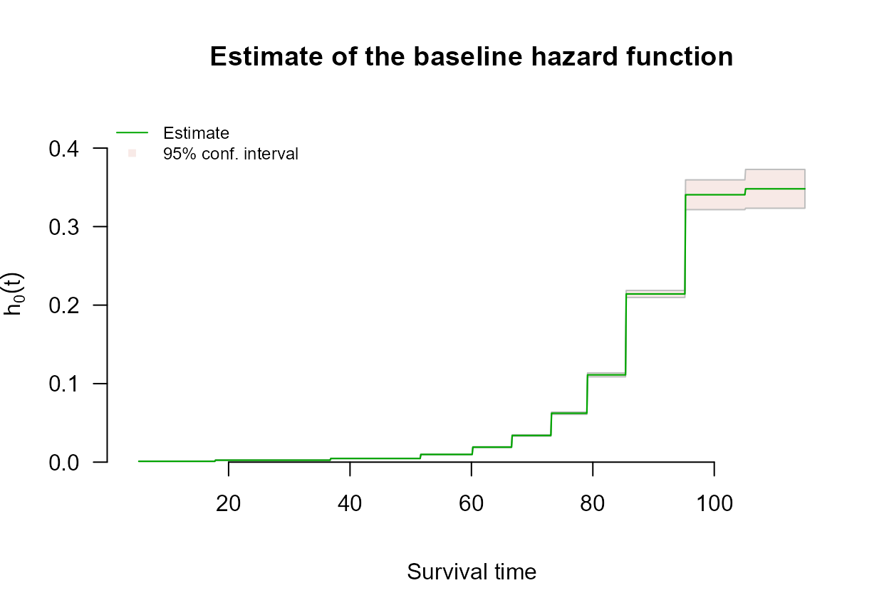

# Left Truncation with survivalMPL

## Overview

A survival time is *left truncated* when any event occurring before some
time $`a_i`$ could never have been observed at all. The truncation time
is also called a **delayed entry** time, because it usually arises from
a condition on entering the study: a subject who fails before meeting
that condition never appears in the data.

Truncation is not censoring, and the difference is fundamental.
Censoring means a survival time is only *partially* observed: the
subject is in the data, and contributes the information that the event
had not yet happened. Truncation means an event time that could have
been observed becomes *entirely* unobservable when it falls before
$`a_i`$: the subject is absent from the data altogether. Treating a
truncation time as time zero for follow-up, and so ignoring the
truncation, leads to biased parameter estimates (Bhaskaran et al.,
n.d.).

Each subject therefore contributes
$`(a_i, y_i, \delta_i, \mathbf{x}_i)`$: the truncation time, the
observed event or censoring time, the event indicator, and the
covariates, with $`a_i`$ strictly less than $`y_i`$.

## Encoding left-truncated observations

Truncation times are not part of the
[`Surv()`](https://rdrr.io/pkg/survival/man/Surv.html) response. Pass
them through the `entry` argument instead:

[`coxph_mpl`](https://CRAN.R-project.org/package=survivalMPL/reference/coxph_mpl.md)`(`[`Surv`](https://rdrr.io/pkg/survival/man/Surv.html)`(``time``, ``status``)`` ``~`` ``x``, data ``=`` ``df``, entry ``=`` ``start``)`

Three things to know:

- **`entry` requires `basis = "uniform"`**, which is the default, so
  nothing else has to be set. Left truncation is implemented by
  differencing the cumulative basis,
  $`H_0(a_i, y_i) = H_0(y_i) - H_0(a_i)`$, which the package supports
  for the piecewise-constant basis. This is not a limitation of the
  method so much as its natural setting: with indicator basis functions
  $`\psi_u(t) = I(t \in B_u)`$ over bins $`B_u = (w_u, w_{u+1}]`$, each
  $`\hat\theta_u`$ has a closed form given $`\boldsymbol{\beta}`$, which
  is what makes the profile likelihood of Bhaskaran et al. (n.d.)
  possible. Asking for any other basis together with `entry` gets you a
  uniform fit and a warning saying so, rather than a silently wrong fit
  or a refusal.
- **Entry times must strictly precede the event or censoring time.** A
  violation is an error, not a warning.
- **Truncated and untruncated subjects may be mixed** in one call. Use
  an entry time of zero, or any value below the first event time, for
  subjects observed from the origin.

## Example: atomic bomb survivors

The bundled `hiroshima` data are left truncated by construction.
Follow-up in the Life Span Study begins on 1 October 1950, several years
after the 1945 exposure, so a subject enters the risk set at the age
they had reached by that date, and anyone who died in between is absent
from the cohort. `entry` is that attained age, and `time` is attained
age at death or at end of follow-up.

[`library`](https://rdrr.io/r/base/library.html)`(`[`survivalMPL`](https://CRAN.R-project.org/package=survivalMPL)`)`` ``#> Loading required package: survival`` ``#> Loading required package: MASS`` `[`library`](https://rdrr.io/r/base/library.html)`(`[`survival`](https://github.com/therneau/survival)`)`` `` `[`data`](https://rdrr.io/r/utils/data.html)`(``hiroshima``)`` `` `[`c`](https://rdrr.io/r/base/c.html)`(``subjects ``=`` `[`nrow`](https://rdrr.io/r/base/nrow.html)`(``hiroshima``)``, deaths ``=`` `[`sum`](https://rdrr.io/r/base/sum.html)`(``hiroshima``$``status``)``)`` ``#> subjects deaths `` ``#> 86611 50620`` `[`round`](https://rdrr.io/r/base/Round.html)`(`[`range`](https://rdrr.io/r/base/range.html)`(``hiroshima``$``entry``)``, ``1``)`` ``#> [1] 5.2 93.8`` `[`round`](https://rdrr.io/r/base/Round.html)`(`[`range`](https://rdrr.io/r/base/range.html)`(``hiroshima``$``time``)``, ``1``)`` ``#> [1] 7.0 114.9`

Entry ages run from 5 to 94 years, so the truncation is substantial
rather than incidental: at any attained age, the subjects at risk are
only those who had already reached that age by late 1950.

`fit_entry`` ``<-`` `[`coxph_mpl`](https://CRAN.R-project.org/package=survivalMPL/reference/coxph_mpl.md)`(`` `` `[`Surv`](https://rdrr.io/pkg/survival/man/Surv.html)`(``time``, ``status``)`` ``~`` ``dose`` ``+`` ``sex`` ``+`` ``city``,`` `` data ``=`` ``hiroshima``,`` `` entry ``=`` ``entry`` ``)`` `` `[`summary`](https://rdrr.io/r/base/summary.html)`(``fit_entry``)`` ``#> `` ``#> coxph_mpl(formula = Surv(time, status) ~ dose + sex + city, data = hiroshima, `` ``#> entry = entry)`` ``#> `` ``#> -----`` ``#> `` ``#> Cox Proportional Hazards Model Fit Using MPL `` ``#> `` ``#> `` ``#> Penalized log-likelihood : -218085.3`` ``#> Estimated smoothing value : 486.6378`` ``#> Convergence : Yes (12 + 292 iter.) `` ``#> `` ``#> Data : hiroshima`` ``#> Number of obs. : 86611`` ``#> Number of events : 50620 (58.44523%)`` ``#> Number of cens. : 35991 (41.55477%)`` ``#> `` ``#> Regression parameters : Surv(time, status) ~ dose + sex + city`` ``#> Estimate Std. Error z-value Pr(>|z|) `` ``#> dose 0.1635084 0.0151308 10.8063 < 2.2e-16 ***`` ``#> sexFemale -0.5518858 0.0092909 -59.4005 < 2.2e-16 ***`` ``#> cityNagasaki 0.0515481 0.0098435 5.2368 1.634e-07 ***`` ``#> ---`` ``#> Signif. codes: 0 '***' 0.001 '**' 0.01 '*' 0.05 '.' 0.1 ' ' 1`` ``#> `` ``#> Baseline hasard parameters approximated using Uniform :`` ``#> (11 equal events bins)`` ``#> 1 2 3 4 5 6 `` ``#> 0.001058039 0.002478473 0.004673498 0.009799451 0.019100936 0.033959813 `` ``#> 7 8 9 10 11 `` ``#> 0.062309691 0.111161804 0.214221247 0.340579097 0.348117394 `` ``#> `` ``#> -----`

The estimated baseline hazard is a hazard by *attained age*, and because
the risk set at each age contains only subjects who had already reached
that age by late 1950, it is the truncation-corrected one:

[`plot`](https://rdrr.io/r/graphics/plot.default.html)`(``fit_entry``, which ``=`` ``2``, ask ``=`` ``FALSE``, cex.main ``=`` ``0.9``)`

Requesting a different basis alongside `entry` does not fail; the fit
falls back to `"uniform"` and says so:

`fallback`` ``<-`` `[`coxph_mpl`](https://CRAN.R-project.org/package=survivalMPL/reference/coxph_mpl.md)`(`` `` `[`Surv`](https://rdrr.io/pkg/survival/man/Surv.html)`(``time``, ``status``)`` ``~`` ``dose`` ``+`` ``sex`` ``+`` ``city``,`` `` data ``=`` ``hiroshima``,`` `` entry ``=`` ``entry``,`` `` basis ``=`` ``"msplines"`` ``)`` ``#> Warning: entry= (left truncation) is only implemented for basis = "uniform";`` ``#> basis "msplines" was replaced by "uniform".`` `` ``fallback``$``control``$``basis`` ``#> [1] "uniform"`

## Limitations

[`predict.coxph_mpl()`](https://CRAN.R-project.org/package=survivalMPL/reference/predict.coxph_mpl.md)
and
[`residuals.coxph_mpl()`](https://CRAN.R-project.org/package=survivalMPL/reference/residuals.coxph_mpl.md)
do not yet account for `entry`: they compute cumulative hazard and
survival from time zero rather than from each subject’s entry time.
Coefficients, baseline hazard estimates and their standard errors are
unaffected. See
[`?coxph_mpl`](https://CRAN.R-project.org/package=survivalMPL/reference/coxph_mpl.md)
for the current status.

## References

Bhaskaran, Aishwarya, Benoit Liquet, and Jun Ma. n.d. *Maximum Profile
Likelihood for Cox Models Under Left Truncation and Right Censoring*.
Macquarie University.
