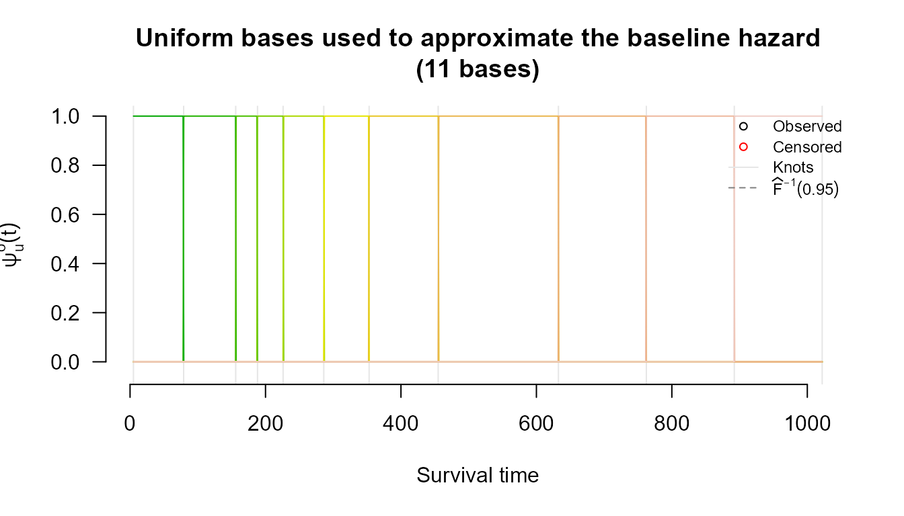
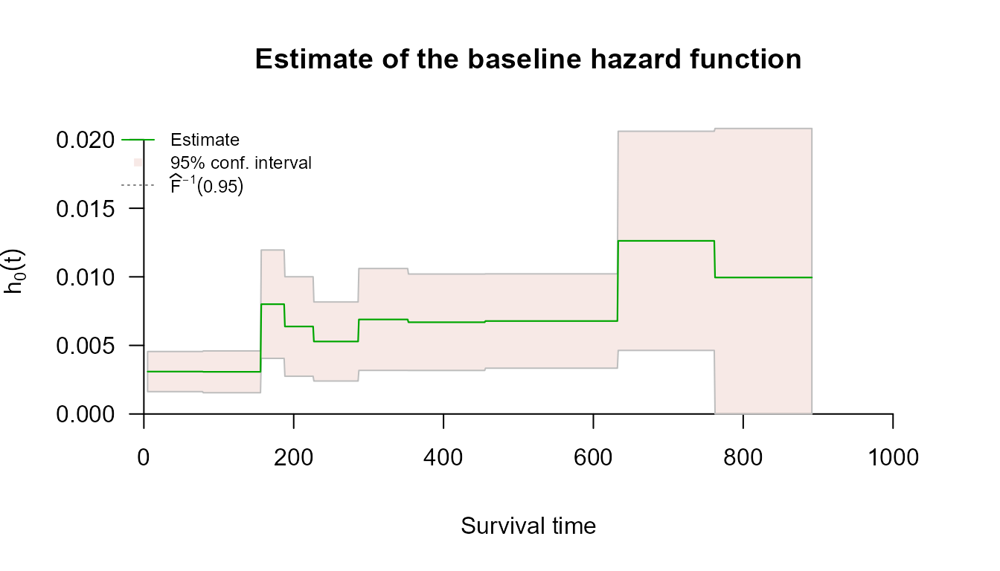
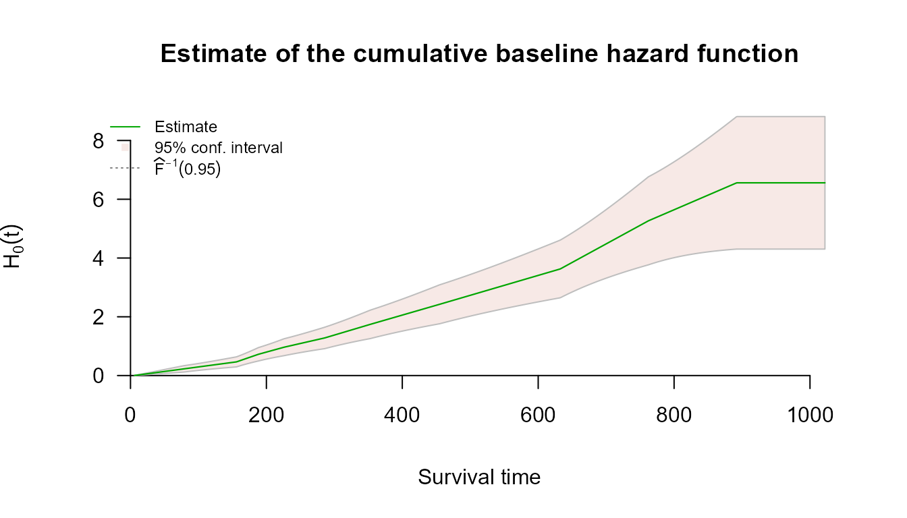
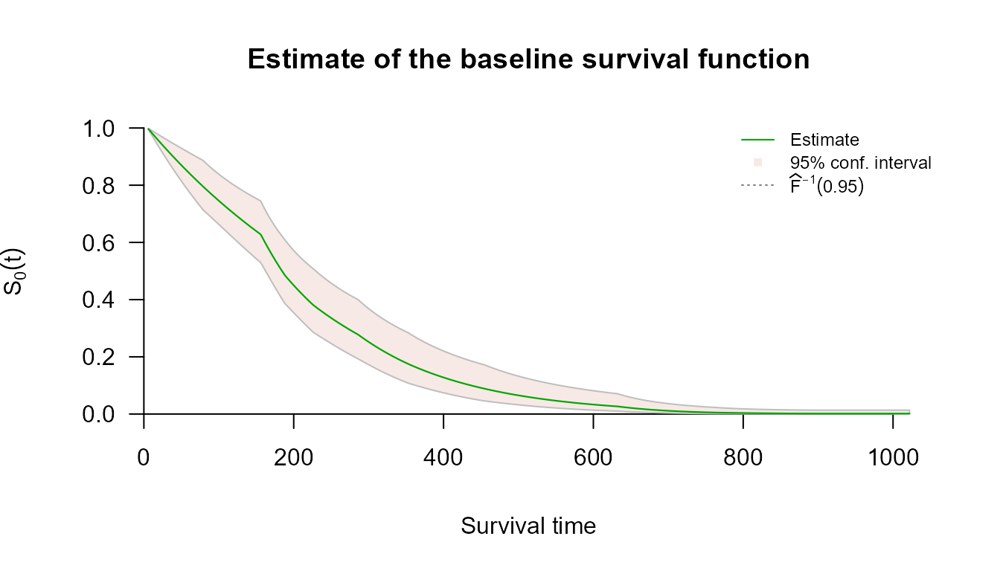
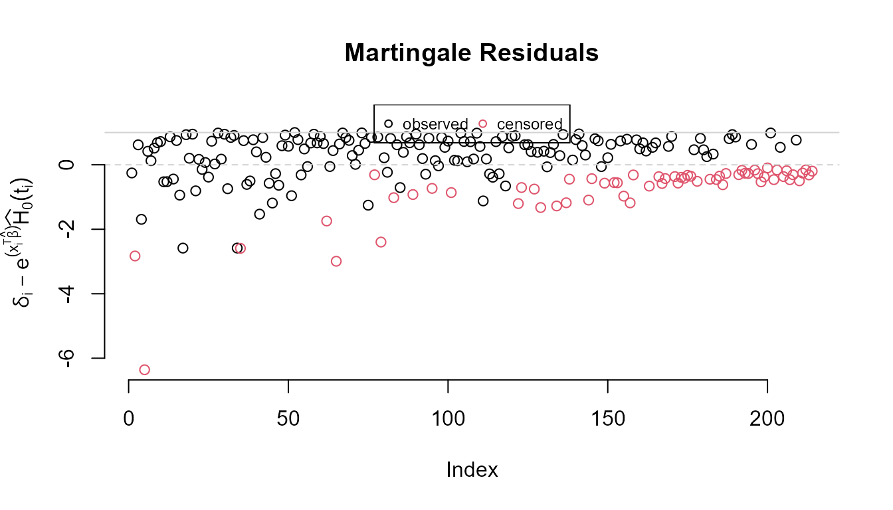
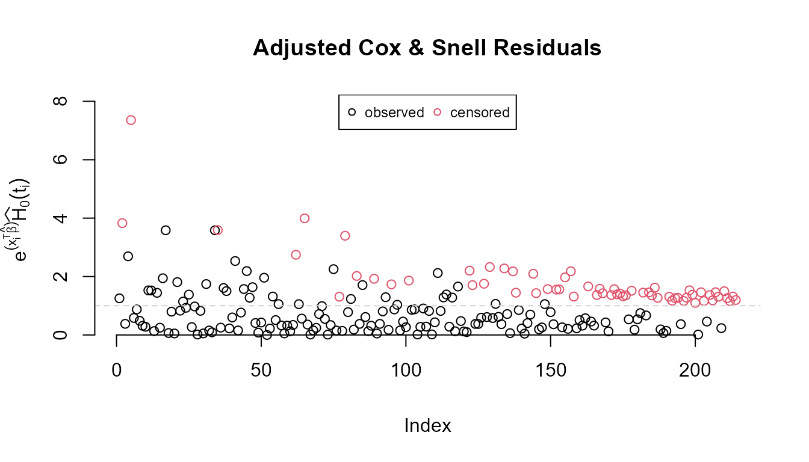

# Right Censoring with survivalMPL

## Overview

A survival time is *right censored* when follow-up ends before the event
occurs: all we know is that the event time exceeds the last observation
time. This is the most common censoring scheme, and the one
[`survival::coxph()`](https://rdrr.io/pkg/survival/man/coxph.html)
handles through the partial likelihood.

[`coxph_mpl()`](https://CRAN.R-project.org/package=survivalMPL/reference/coxph_mpl.md)
fits the same proportional hazards model, but estimates the baseline
hazard $`h_0`$ jointly with $`\boldsymbol{\beta}`$ instead of profiling
it out. The practical consequence is that a fit gives absolute hazard
and survival estimates directly, with standard errors, rather than
requiring a separate Breslow-type step afterwards.

Right-censored data use the ordinary two-argument response, exactly as
in [`coxph()`](https://rdrr.io/pkg/survival/man/coxph.html):

[`Surv`](https://rdrr.io/pkg/survival/man/Surv.html)`(``time``, ``status``)`

where `status` is `1`/`TRUE` for an observed event and `0`/`FALSE` for a
censored observation.

------------------------------------------------------------------------

## Example — `survival::lung`

The `lung` data from the **survival** package records survival in
patients with advanced lung cancer. `status` is coded `2` for death and
`1` for censored, so the event indicator is `status == 2`.

[`library`](https://rdrr.io/r/base/library.html)`(`[`survivalMPL`](https://CRAN.R-project.org/package=survivalMPL)`)`` ``#> Loading required package: survival`` ``#> Loading required package: MASS`` `[`library`](https://rdrr.io/r/base/library.html)`(`[`survival`](https://github.com/therneau/survival)`)`` `` ``lung`` ``<-`` `[`na.omit`](https://rdrr.io/r/stats/na.fail.html)`(``lung``[``, `[`c`](https://rdrr.io/r/base/c.html)`(``"time"``, ``"status"``, ``"age"``, ``"sex"``, ``"ph.karno"``, ``"wt.loss"``)``]``)`` `` `[`c`](https://rdrr.io/r/base/c.html)`(``n ``=`` `[`nrow`](https://rdrr.io/r/base/nrow.html)`(``lung``)``, events ``=`` `[`sum`](https://rdrr.io/r/base/sum.html)`(``lung``$``status`` ``==`` ``2``)``,`` `` censored ``=`` `[`sum`](https://rdrr.io/r/base/sum.html)`(``lung``$``status`` ``==`` ``1``)``)`` ``#> n events censored `` ``#> 214 152 62`

### Model fit

`n.obs` tells
[`coxph_mpl.control()`](https://CRAN.R-project.org/package=survivalMPL/reference/coxph_mpl.control.md)
how many exact events there are, which sets the default number of knots
for the baseline hazard. Here we fix the smoothing parameter at
`smooth = 0` (no penalty) to keep the example fast; leaving
`smooth = NULL` estimates it by REML instead.

`fit_lung`` ``<-`` `[`coxph_mpl`](https://CRAN.R-project.org/package=survivalMPL/reference/coxph_mpl.md)`(`` `` `[`Surv`](https://rdrr.io/pkg/survival/man/Surv.html)`(``time``, ``status`` ``==`` ``2``)`` ``~`` ``age`` ``+`` ``sex`` ``+`` ``ph.karno`` ``+`` ``wt.loss``,`` `` data ``=`` ``lung``,`` `` control ``=`` `[`coxph_mpl.control`](https://CRAN.R-project.org/package=survivalMPL/reference/coxph_mpl.control.md)`(`` `` n.obs ``=`` `[`sum`](https://rdrr.io/r/base/sum.html)`(``lung``$``status`` ``==`` ``2``)``,`` `` max.iter ``=`` `[`c`](https://rdrr.io/r/base/c.html)`(``40``, ``2000``, ``4000``)``,`` `` smooth ``=`` ``0`` `` ``)`` ``)`` `` `[`summary`](https://rdrr.io/r/base/summary.html)`(``fit_lung``)`` ``#> `` ``#> coxph_mpl(formula = Surv(time, status == 2) ~ age + sex + ph.karno + `` ``#> wt.loss, data = lung, control = coxph_mpl.control(n.obs = sum(lung$status == `` ``#> 2), max.iter = c(40, 2000, 4000), smooth = 0))`` ``#> `` ``#> -----`` ``#> `` ``#> Cox Proportional Hazards Model Fit Using MPL `` ``#> `` ``#> `` ``#> Penalized log-likelihood : -1052.062`` ``#> Fixed smoothing value : 0`` ``#> Convergence : Yes (8 iter.) `` ``#> `` ``#> Data : lung`` ``#> Number of obs. : 214`` ``#> Number of events : 152 (71.02804%)`` ``#> Number of cens. : 62 (28.97196%)`` ``#> `` ``#> Regression parameters : Surv(time, status == 2) ~ age + sex + ph.karno + wt.loss`` ``#> Estimate Std. Error z-value Pr(>|z|) `` ``#> age 0.0151013 0.0101696 1.4849 0.137559 `` ``#> sex -0.5148282 0.1691462 -3.0437 0.002337 **`` ``#> ph.karno -0.0126768 0.0086042 -1.4733 0.140664 `` ``#> wt.loss -0.0020624 0.0069833 -0.2953 0.767745 `` ``#> ---`` ``#> Signif. codes: 0 '***' 0.001 '**' 0.01 '*' 0.05 '.' 0.1 ' ' 1`` ``#> `` ``#> Baseline hasard parameters approximated using Uniform :`` ``#> (11 equal events bins)`` ``#> 1 2 3 4 5 6 `` ``#> 3.091190e-03 3.073782e-03 8.005268e-03 6.378672e-03 5.284837e-03 6.891828e-03 `` ``#> 7 8 9 10 11 `` ``#> 6.688682e-03 6.777236e-03 1.262414e-02 9.950425e-03 2.312947e-10 `` ``#> `` ``#> -----`

The coefficient table is read as in any Cox fit: `sex` is strongly
protective (coded 1 = male, 2 = female), and higher `ph.karno` — better
performance status — is associated with lower hazard. The summary also
reports the estimated baseline hazard coefficients
$`\boldsymbol{\theta}`$, which have no counterpart in a partial
likelihood fit.

### Baseline hazard and survival

Because $`h_0`$ is part of the model, it can be plotted with confidence
bands straight from the fitted object:

[`plot`](https://rdrr.io/r/graphics/plot.default.html)`(``fit_lung``)`

### Predicted survival

[`predict()`](https://rdrr.io/r/stats/predict.html) returns absolute
estimates with standard errors and pointwise confidence limits. With no
`i` argument it evaluates at the mean covariate vector:

`pred_lung`` ``<-`` `[`predict`](https://rdrr.io/r/stats/predict.html)`(``fit_lung``, type ``=`` ``"survival"``)`` `[`head`](https://rdrr.io/r/utils/head.html)`(``pred_lung``)`` ``#> time survival se low high`` ``#> 1 4.999000 1.0000000 0.0000000000 1.0000000 1.0000000`` ``#> 2 6.017019 0.9986404 0.0002927774 0.9980548 0.9992259`` ``#> 3 7.035038 0.9972826 0.0005847586 0.9961131 0.9984521`` ``#> 4 8.053057 0.9959267 0.0008759453 0.9941748 0.9976785`` ``#> 5 9.071076 0.9945726 0.0011663392 0.9922399 0.9969052`` ``#> 6 10.089095 0.9932203 0.0014559417 0.9903084 0.9961322`

A single subject is selected with `i` (one row index at a time — only
the first element is used):

`pred_one`` ``<-`` `[`predict`](https://rdrr.io/r/stats/predict.html)`(``fit_lung``, type ``=`` ``"survival"``, i ``=`` ``1``)`` `[`head`](https://rdrr.io/r/utils/head.html)`(``pred_one``)`` ``#> time survival se low high`` ``#> 1 4.999000 1.0000000 0.0000000000 1.0000000 1.0000000`` ``#> 2 6.017019 0.9983745 0.0003499798 0.9976746 0.9990745`` ``#> 3 7.035038 0.9967517 0.0006988218 0.9953540 0.9981493`` ``#> 4 8.053057 0.9951315 0.0010465287 0.9930384 0.9972245`` ``#> 5 9.071076 0.9935139 0.0013931035 0.9907277 0.9963001`` ``#> 6 10.089095 0.9918989 0.0017385488 0.9884218 0.9953760`

### Residuals

Martingale residuals are available for checking the fit:

[`plot`](https://rdrr.io/r/graphics/plot.default.html)`(`[`residuals`](https://rdrr.io/r/stats/residuals.html)`(``fit_lung``)``)`

------------------------------------------------------------------------

## Left truncation (delayed entry)

Right-censored data are often also *left truncated*: subjects enter the
risk set only at some entry time, and anyone who fails before that time
is never observed. Pass those times through `entry`:

[`coxph_mpl`](https://CRAN.R-project.org/package=survivalMPL/reference/coxph_mpl.md)`(`[`Surv`](https://rdrr.io/pkg/survival/man/Surv.html)`(``time``, ``status``)`` ``~`` ``x``, data ``=`` ``df``, entry ``=`` ``df``$``start``,`` `` control ``=`` `[`coxph_mpl.control`](https://CRAN.R-project.org/package=survivalMPL/reference/coxph_mpl.control.md)`(``basis ``=`` ``"uniform"``, n.obs ``=`` `[`sum`](https://rdrr.io/r/base/sum.html)`(``df``$``status``)``)``)`

Entry times must strictly precede the observed event or censoring time,
and left truncation currently requires `basis = "uniform"`. Truncated
and untruncated subjects may be mixed in the same call. See
[`?coxph_mpl`](https://CRAN.R-project.org/package=survivalMPL/reference/coxph_mpl.md)
for details.

------------------------------------------------------------------------

## Next steps

- **Left Censoring** and **Interval Censoring** cover the other
  censoring schemes, which use the `type = "interval2"` response.
- **Basis Functions for the Baseline Hazard** explains the four choices
  for $`\psi_u`$ and how the knots are placed.
- **Comparing `coxph` and `coxph_mpl`** fits both to the same
  right-censored data and contrasts the results.
