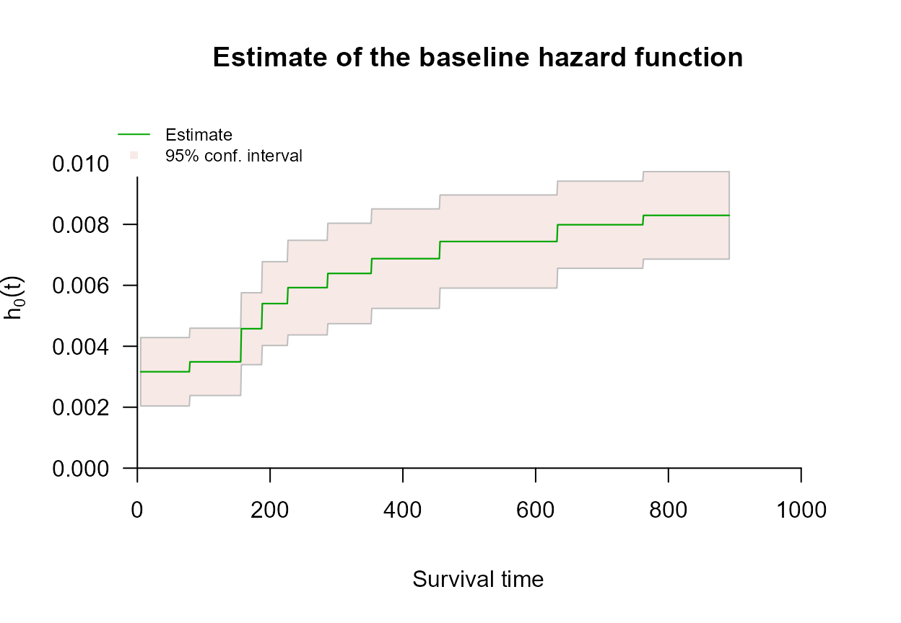

# Right Censoring with survivalMPL

## Overview

A survival time is *right censored* when follow-up ends before the event
occurs: all we know is that the event time exceeds the last observation
time. This is the most common censoring scheme, and the one
[`survival::coxph()`](https://rdrr.io/pkg/survival/man/coxph.html)
handles through the partial likelihood.

[`coxph_mpl()`](https://CRAN.R-project.org/package=survivalMPL/reference/coxph_mpl.md)
fits the same proportional hazards model, but estimates the baseline
hazard $`h_0`$ jointly with $`\boldsymbol{\beta}`$ instead of profiling
it out. The practical consequence is that a fit gives absolute hazard
and survival estimates directly, with standard errors, rather than
requiring a separate Breslow-type step afterwards.

## Encoding right-censored observations

Right-censored data use the ordinary two-argument response, exactly as
in [`coxph()`](https://rdrr.io/pkg/survival/man/coxph.html):

[`Surv`](https://rdrr.io/pkg/survival/man/Surv.html)`(``time``, ``status``)`

where `status` is `1`/`TRUE` for an observed event and `0`/`FALSE` for a
censored observation. This is the one scheme that does not need
`type = "interval2"`; internally
[`coxph_mpl()`](https://CRAN.R-project.org/package=survivalMPL/reference/coxph_mpl.md)
converts it to that form anyway.

------------------------------------------------------------------------

## Example: `survival::lung`

The `lung` data from the **survival** package records survival in
patients with advanced lung cancer. `status` is coded `2` for death and
`1` for censored, so the event indicator is `status == 2`.

[`library`](https://rdrr.io/r/base/library.html)`(`[`survivalMPL`](https://CRAN.R-project.org/package=survivalMPL)`)`` ``#> Loading required package: survival`` ``#> Loading required package: MASS`` `[`library`](https://rdrr.io/r/base/library.html)`(`[`survival`](https://github.com/therneau/survival)`)`` `` ``lung`` ``<-`` `[`na.omit`](https://rdrr.io/r/stats/na.fail.html)`(``lung``[``, `[`c`](https://rdrr.io/r/base/c.html)`(``"time"``, ``"status"``, ``"age"``, ``"sex"``, ``"ph.karno"``, ``"wt.loss"``)``]``)`` `` `[`c`](https://rdrr.io/r/base/c.html)`(``n ``=`` `[`nrow`](https://rdrr.io/r/base/nrow.html)`(``lung``)``, events ``=`` `[`sum`](https://rdrr.io/r/base/sum.html)`(``lung``$``status`` ``==`` ``2``)``,`` `` censored ``=`` `[`sum`](https://rdrr.io/r/base/sum.html)`(``lung``$``status`` ``==`` ``1``)``)`` ``#> n events censored `` ``#> 214 152 62`

### Model fit

Little beyond the formula and the data is required. The defaults use a
uniform (piecewise-constant) baseline hazard, take the number of knots
from the number of events, and select the smoothing value $`\lambda`$
automatically by the marginal likelihood method. The one change made
here is the convergence tolerance, set to the $`10^{-5}`$ used
throughout Ma et al. (2024); at the default $`10^{-7}`$ the outer
iterations do not settle on this dataset - see **Control Parameters**:

`fit_lung`` ``<-`` `[`coxph_mpl`](https://CRAN.R-project.org/package=survivalMPL/reference/coxph_mpl.md)`(`` `` `[`Surv`](https://rdrr.io/pkg/survival/man/Surv.html)`(``time``, ``status`` ``==`` ``2``)`` ``~`` ``age`` ``+`` ``sex`` ``+`` ``ph.karno`` ``+`` ``wt.loss``,`` `` data ``=`` ``lung``,`` `` tol ``=`` ``1e-05`` ``)`` `` `[`summary`](https://rdrr.io/r/base/summary.html)`(``fit_lung``)`` ``#> `` ``#> coxph_mpl(formula = Surv(time, status == 2) ~ age + sex + ph.karno + `` ``#> wt.loss, data = lung, tol = 1e-05)`` ``#> `` ``#> -----`` ``#> `` ``#> Cox Proportional Hazards Model Fit Using MPL `` ``#> `` ``#> `` ``#> Penalized log-likelihood : -1059.173`` ``#> Estimated smoothing value : 5945063`` ``#> Convergence : Yes (101 + 571 iter.) `` ``#> `` ``#> Data : lung`` ``#> Number of obs. : 214`` ``#> Number of events : 152 (71.02804%)`` ``#> Number of cens. : 62 (28.97196%)`` ``#> `` ``#> Regression parameters : Surv(time, status == 2) ~ age + sex + ph.karno + wt.loss`` ``#> Estimate Std. Error z-value Pr(>|z|) `` ``#> age 0.0144154 0.0101531 1.4198 0.155666 `` ``#> sex -0.5103399 0.1708342 -2.9873 0.002814 **`` ``#> ph.karno -0.0117159 0.0089906 -1.3031 0.192529 `` ``#> wt.loss -0.0017065 0.0071640 -0.2382 0.811722 `` ``#> ---`` ``#> Signif. codes: 0 '***' 0.001 '**' 0.01 '*' 0.05 '.' 0.1 ' ' 1`` ``#> `` ``#> Baseline hasard parameters approximated using Uniform :`` ``#> (11 equal events bins)`` ``#> 1 2 3 4 5 6 `` ``#> 0.003163491 0.003488916 0.004576128 0.005400816 0.005924636 0.006389894 `` ``#> 7 8 9 10 11 `` ``#> 0.006875642 0.007437590 0.007988655 0.008295504 0.008327673 `` ``#> `` ``#> -----`

The coefficient table is read as in any Cox fit: `sex` is strongly
protective (coded 1 = male, 2 = female), and higher `ph.karno` (better
performance status) is associated with lower hazard. The summary also
reports the estimated baseline hazard coefficients
$`\boldsymbol{\theta}`$, which have no counterpart in a partial
likelihood fit.

Every one of those defaults can be overridden through
[`coxph_mpl.control()`](https://CRAN.R-project.org/package=survivalMPL/reference/coxph_mpl.control.md) -
the basis, the knots, the smoothing parameter, the iteration limits. The
**Control Parameters** article covers them one at a time.

### Baseline hazard and survival

Because $`h_0`$ is part of the model, it can be plotted with confidence
bands straight from the fitted object.
[`plot()`](https://rdrr.io/r/graphics/plot.default.html) produces four
panels: the basis functions, then the estimated baseline hazard,
cumulative hazard and survival.

[`par`](https://rdrr.io/r/graphics/par.html)`(``mfrow ``=`` `[`c`](https://rdrr.io/r/base/c.html)`(``2``, ``2``)``, mar ``=`` `[`c`](https://rdrr.io/r/base/c.html)`(``4``, ``4``, ``3``, ``1``)``)`` `[`plot`](https://rdrr.io/r/graphics/plot.default.html)`(``fit_lung``, ask ``=`` ``FALSE``, cex.main ``=`` ``0.8``)`


In the first panel each of the $`m`$ basis functions is drawn in its own
colour, running through
[`terrain.colors()`](https://rdrr.io/r/grDevices/palettes.html) from the
earliest to the latest, so the colour simply indexes $`u`$ in $`\psi_u`$
and carries no other meaning. With the default uniform basis each
$`\psi_u`$ is an indicator on one knot interval, so the panel reads as a
row of adjacent boxes of height 1, one colour per interval; the pale
grey verticals are the knots $`\boldsymbol{\alpha}`$. A basis drawn
dashed would indicate $`\hat\theta_u`$ driven to zero, meaning that
interval contributes nothing to the fitted hazard.

The second panel is the estimated baseline hazard itself: a step
function whose height on knot interval $`u`$ is $`\hat\theta_u`$. It is
the one quantity a partial likelihood fit cannot give you, so it is
worth drawing on its own:

[`plot`](https://rdrr.io/r/graphics/plot.default.html)`(``fit_lung``, which ``=`` ``2``, ask ``=`` ``FALSE``, cex.main ``=`` ``0.9``)`



The hazard climbs steadily across follow-up - more than doubling between
the first knot interval and the last - and flattens only in the final
intervals, where few patients remain at risk and the confidence band
widens accordingly.

### Predicted survival

[`predict()`](https://rdrr.io/r/stats/predict.html) returns absolute
estimates with standard errors and pointwise confidence limits. With no
`i` argument it evaluates at the mean covariate vector:

`pred_lung`` ``<-`` `[`predict`](https://rdrr.io/r/stats/predict.html)`(``fit_lung``, type ``=`` ``"survival"``)`` `[`head`](https://rdrr.io/r/utils/head.html)`(``pred_lung``)`` ``#> time survival se low high`` ``#> 1 4.999000 1.0000000 0.0000000000 1.0000000 1.0000000`` ``#> 2 6.017019 0.9985435 0.0002149955 0.9981135 0.9989734`` ``#> 3 7.035038 0.9970890 0.0004293647 0.9962303 0.9979478`` ``#> 4 8.053057 0.9956367 0.0006431090 0.9943505 0.9969229`` ``#> 5 9.071076 0.9941865 0.0008562298 0.9924741 0.9958990`` ``#> 6 10.089095 0.9927385 0.0010687283 0.9906010 0.9948759`

A single subject is selected with `i` (one row index at a time; only the
first element is used):

`pred_one`` ``<-`` `[`predict`](https://rdrr.io/r/stats/predict.html)`(``fit_lung``, type ``=`` ``"survival"``, i ``=`` ``1``)`` `[`head`](https://rdrr.io/r/utils/head.html)`(``pred_one``)`` ``#> time survival se low high`` ``#> 1 4.999000 1.0000000 0.0000000000 1.0000000 1.0000000`` ``#> 2 6.017019 0.9982519 0.0002579962 0.9977359 0.9987679`` ``#> 3 7.035038 0.9965068 0.0005150903 0.9954766 0.9975370`` ``#> 4 8.053057 0.9947648 0.0007712848 0.9932222 0.9963074`` ``#> 5 9.071076 0.9930258 0.0010265820 0.9909727 0.9950790`` ``#> 6 10.089095 0.9912899 0.0012809843 0.9887279 0.9938519`

------------------------------------------------------------------------

## Residuals

[`residuals()`](https://rdrr.io/r/stats/residuals.html) returns both
Cox-Snell and martingale residuals. For a subject observed exactly, the
Cox-Snell residual is the fitted cumulative hazard that subject
accumulated,

``` math
r^{CS}_i = e^{\mathbf{x}_i^T\hat{\boldsymbol{\beta}}}\,\hat H_0(t_i),
```

with censored observations adjusted so that every residual estimates the
same quantity under the model. The martingale residual is then
$`\hat M_i = \delta_i - r^{CS}_i`$: the difference between the number of
events actually observed for subject $`i`$ (0 or 1) and the number the
model expects.

`res_lung`` ``<-`` `[`residuals`](https://rdrr.io/r/stats/residuals.html)`(``fit_lung``)`` `[`par`](https://rdrr.io/r/graphics/par.html)`(``mfrow ``=`` `[`c`](https://rdrr.io/r/base/c.html)`(``1``, ``2``)``, mar ``=`` `[`c`](https://rdrr.io/r/base/c.html)`(``4``, ``4``, ``3``, ``1``)``)`` `[`plot`](https://rdrr.io/r/graphics/plot.default.html)`(``res_lung``, which ``=`` ``1``:``2``, ask ``=`` ``FALSE``)`


Read them as follows.

- **Martingale residuals** are bounded above by 1 and unbounded below,
  so the cloud is asymmetric by construction: censored observations
  (red) are at or below zero, events (black) are pulled towards 1. A
  residual close to 1 marks a subject who died far earlier than the
  model predicted, a large negative one a subject who survived far
  longer. Here a handful of subjects sit below $`-2`$, one of them near
  $`-6`$: those are the long survivors the fitted model finds most
  surprising, and they are worth looking at individually before
  concluding anything about the model as a whole.
- **Cox-Snell residuals** behave like a censored sample from a unit
  exponential distribution when the model is correct, so most sit below
  1 with a thinning right tail. A mass of residuals far above 1
  indicates the fitted cumulative hazard is wrong, usually through a
  mis-specified covariate effect rather than a mis-specified baseline.

The horizontal axis of both panels is the row number, which carries
meaning only if the rows arrived in a meaningless order. In `lung` they
did not: the censored subjects are concentrated in the later rows (3 of
the first 54 are censored, against 36 of the last 53), which is why the
red points drift to the right of both panels. That is a fact about the
data file, not about the fit.

------------------------------------------------------------------------

## Next steps

- **Control Parameters** covers
  [`coxph_mpl.control()`](https://CRAN.R-project.org/package=survivalMPL/reference/coxph_mpl.control.md):
  the basis, the knots, the smoothing value $`\lambda`$, the iteration
  limits and the convergence tolerance used above.
- **Left Truncation** covers delayed entry, where subjects join the risk
  set only at some entry time. Right-censored data are often also left
  truncated, and
  [`coxph_mpl()`](https://CRAN.R-project.org/package=survivalMPL/reference/coxph_mpl.md)
  handles it through the `entry` argument.
- **Left Censoring** and **Interval Censoring** cover the other
  censoring schemes, which use the `type = "interval2"` response.
- **Basis Functions for the Baseline Hazard** explains the four choices
  for $`\psi_u`$ and how the knots are placed.
- **Comparing [`coxph()`](https://rdrr.io/pkg/survival/man/coxph.html)
  and
  [`coxph_mpl()`](https://CRAN.R-project.org/package=survivalMPL/reference/coxph_mpl.md)**
  fits both to the same right-censored data and contrasts the results.

## References

Ma, Jun, Annabel Webb, and Harold Malcolm Hudson. 2024. *Likelihood
Methods in Survival Analysis: With R Examples*. 1st ed. Chapman;
Hall/CRC. <https://doi.org/10.1201/9781351109710>.
