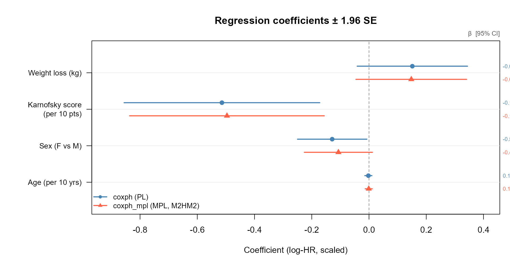
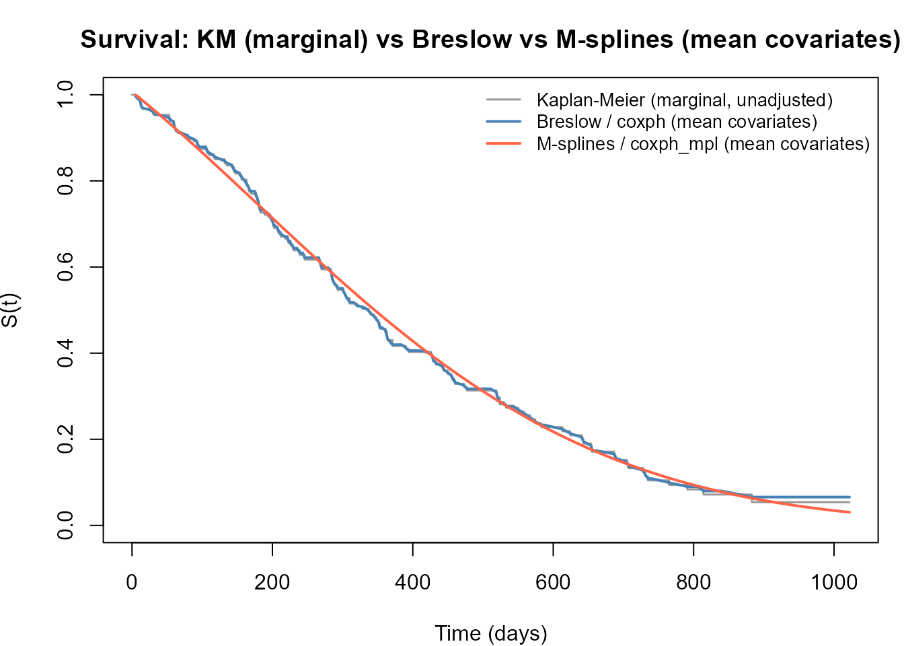

# Comparing coxph and coxph_mpl

## Overview

[`survival::coxph()`](https://rdrr.io/pkg/survival/man/coxph.html)
maximises the *partial likelihood* — a function of regression
coefficients $`\boldsymbol{\beta}`$ only, with the baseline hazard
$`h_0(t)`$ profiled out.
[`survivalMPL::coxph_mpl()`](https://CRAN.R-project.org/package=survivalMPL/reference/coxph_mpl.md)
maximises the *penalised full likelihood*, estimating
$`\boldsymbol{\beta}`$ and $`h_0(t)`$ jointly via a smooth basis
expansion.

For right-censored data with non-informative censoring the two
approaches produce essentially the same $`\hat{\boldsymbol{\beta}}`$ and
standard errors (Ma et al. 2014), while `coxph_mpl` additionally
delivers a smooth, closed-form $`\hat{h}_0(t)`$ that can be plotted and
predicted without additional post-processing.

This tutorial uses the `lung` dataset (`survival` package) — 228
patients with advanced lung cancer, right-censored overall survival — to
compare:

1.  Regression coefficient estimates and standard errors.
2.  95 % confidence intervals (forest plot).
3.  Estimated baseline survival: Kaplan–Meier, Breslow (from `coxph`),
    and M-spline (from `coxph_mpl`).

------------------------------------------------------------------------

## Data and model fits

``` r

library(survivalMPL)
#> Loading required package: survival
#> Loading required package: MASS
library(survival)

lung <- na.omit(lung[, c("time", "status", "age", "sex", "ph.karno", "wt.loss")])
f    <- Surv(time, status == 2) ~ age + sex + ph.karno + wt.loss

# --- partial likelihood (coxph) ---
fit_pl <- coxph(f, data = lung, x = TRUE)

# --- penalised full likelihood, M-splines (coxph_mpl) ---
fit_mpl <- coxph_mpl(f, data = lung,
  control = coxph_mpl.control(
    basis    = "msplines",
    n.obs    = sum(lung$status == 2),
    max.iter = c(150, 7.5e4, 1e6)
  )
)
```

------------------------------------------------------------------------

## Regression coefficients and standard errors

``` r

beta_pl  <- coef(fit_pl)
se_pl    <- sqrt(diag(vcov(fit_pl)))

beta_mpl <- coef(fit_mpl)
se_mpl   <- fit_mpl$se$Beta$M2HM2

tab <- data.frame(
  `PL β`      = round(beta_pl,  4),
  `PL SE`     = round(se_pl,    4),
  `MPL β`     = round(beta_mpl, 4),
  `MPL SE`    = round(se_mpl,   4),
  `Δβ`        = round(beta_mpl - beta_pl, 4),
  check.names = FALSE
)
knitr::kable(tab, align = "rrrrr")
```

|          |    PL β |  PL SE |   MPL β | MPL SE |      Δβ |
|:---------|--------:|-------:|--------:|-------:|--------:|
| age      |  0.0151 | 0.0098 |  0.0148 | 0.0099 | -0.0004 |
| sex      | -0.5140 | 0.1744 | -0.4964 | 0.1735 |  0.0176 |
| ph.karno | -0.0129 | 0.0062 | -0.0107 | 0.0061 |  0.0022 |
| wt.loss  | -0.0022 | 0.0064 | -0.0010 | 0.0063 |  0.0012 |

The estimates agree closely: the full-likelihood approach recovers the
same regression signal as partial likelihood, with near-identical
standard errors. The `MPL SE` reported here uses the sandwich variance
estimator for a fixed smoothing parameter derived in Ma et al. (2014)
(equation 29), accessed via `se = "M2HM2"` in the package. Note that
`age` and `ph.karno` are shown per raw unit (10-year and 1-point changes
respectively) in the table; the forest plot rescales both to per-10-unit
changes for visual comparability.

------------------------------------------------------------------------

## Forest plot



------------------------------------------------------------------------

## Baseline survival comparison

Three estimators of the *baseline* survival function $`S_0(t)`$,
evaluated at mean covariate values:

- **Kaplan–Meier** — nonparametric, unadjusted for covariates.
- **Breslow** — Nelson–Aalen step-function baseline from `coxph`,
  adjusted to mean covariates via
  [`survfit()`](https://rdrr.io/pkg/survival/man/survfit.html).
- **M-splines (MPL)** — smooth closed-form estimate from `coxph_mpl`.



The Breslow estimate is a step function that jumps only at observed
event times. The M-spline estimate is smooth by construction and closely
tracks the Breslow curve, while avoiding the staircase artefacts that
arise from tied or sparse event times.

------------------------------------------------------------------------

## References

Ma, Jun, Stephane Héritier, and Serigne N. Lo. 2014. “On the Maximum
Penalized Likelihood Approach for Proportional Hazard Models with Right
Censored Survival Data.” *Computational Statistics & Data Analysis* 74:
142–56. <https://doi.org/10.1016/j.csda.2014.01.005>.
