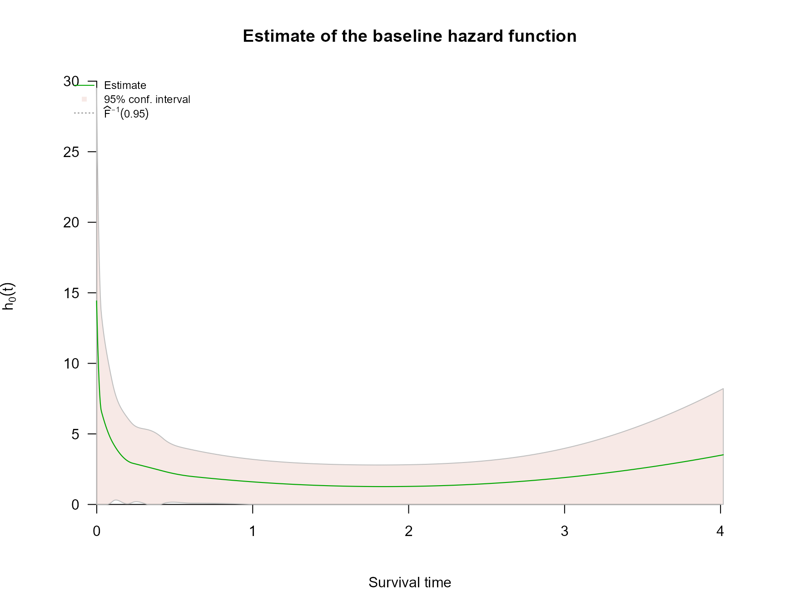
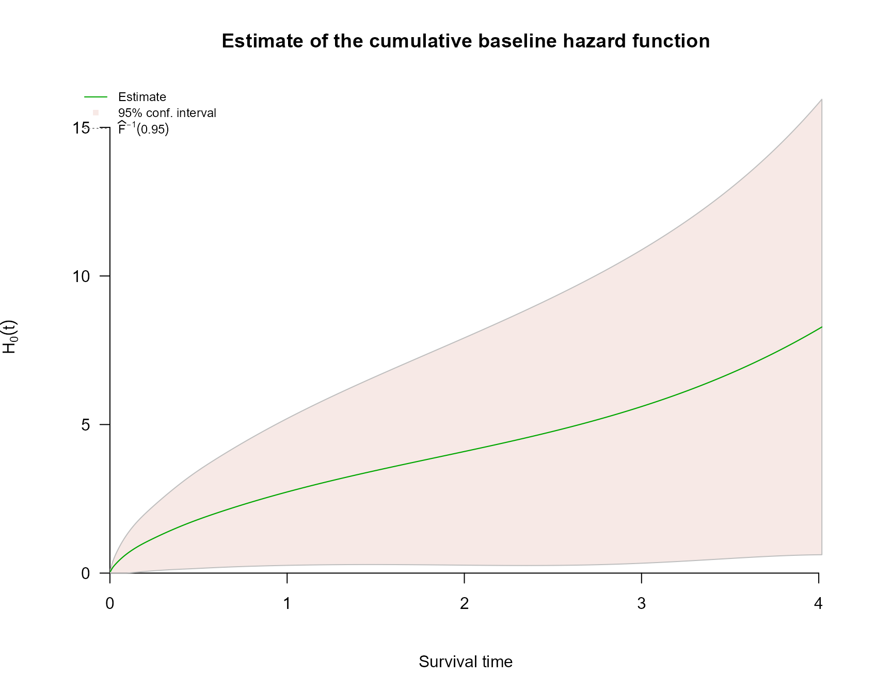
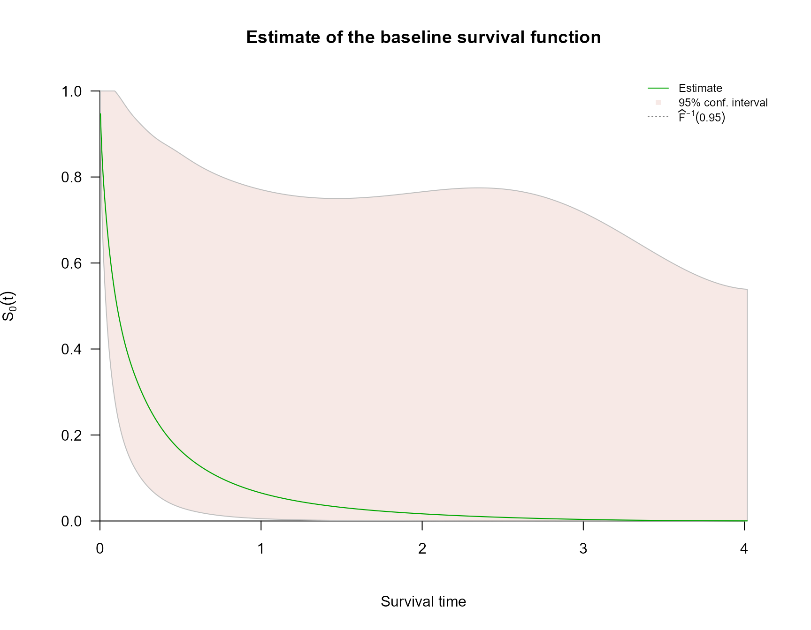

# Interval Censoring with survivalMPL

## Overview

Survival times are *interval-censored* when the event is known to have
occurred in an interval $`(t_L, t_R]`$ rather than at an exact time.
This is common in clinical studies where patients are examined only
periodically (e.g. follow-up visits).

`survivalMPL` handles partly interval-censored data — datasets that may
contain a mix of exact event times and left-, right-, and
interval-censored observations. The censoring type is communicated
through `survival::Surv(..., type = "interval2")`.

This tutorial presents two examples from Ma et al. (2024).

------------------------------------------------------------------------

## Example - Simulation study

We compare the MPL M-spline method against partial likelihood (PL) with
midpoint imputation. The true model is a Cox model with Weibull baseline
hazard $`h_0(t) = 3t^2`$, covariates $`X_1 \sim \text{Unif}(0,1)`$ and
$`X_2 \sim \text{Unif}(0,5)`$, and true coefficients
$`\beta = [0.75,\,-0.50]^T`$.

### `simulate()` function

``` r

library(survivalMPL)
#> Loading required package: survival
#> Loading required package: MASS
library(survival)

# Write simulate() function to repeatedly generate a sample
simulate <- function(n, pi_E, g1, g2){

  # Simulate covariates
  x1 <- runif(n, 0, 1)
  x2 <- 5 * runif(n, 0, 1)
  X <- cbind(x1, x2)
  beta_true <- c(0.75, -0.5)
  eXtB <- exp(X %*% beta_true)

  # Simulate true event times
  neg.log.u <- - log(runif(n, 0, 1))
  y_i <- (neg.log.u/(eXtB))^(1/3)

  # Simulate censoring types & times
  u_E <- runif(n, 0, 1)
  u_L <- runif(n, 0, 1)
  u_R <- runif(n, u_L, 1)

  t_L <- (y_i^as.numeric(u_E < pi_E)) *
    (g1 * u_L)^as.numeric(pi_E < u_E & g1*u_L <= y_i & y_i <= g2*u_R) *
    (g2 * u_R)^as.numeric(pi_E < u_E & g2*u_R < y_i) *
    0^as.numeric(pi_E < u_E & y_i < g1*u_L)

  t_R <- (y_i^as.numeric(u_E < pi_E)) *
    (g1 * u_L)^as.numeric(pi_E < u_E & y_i < g1*u_L) *
    (g2 * u_R)^as.numeric(pi_E < u_E & g1*u_L <= y_i & y_i <= g2*u_R) *
    Inf^(pi_E < u_E & g2*u_R < y_i)

  # Compute midpoint and censoring type for midpoint imputation
  midpoint <- t_L + (t_R - t_L)/2
  event <- rep(1, n)
  event[which(is.infinite(midpoint))] <- 0
  midpoint[which(is.infinite(midpoint))] <- t_L[which(is.infinite(midpoint))]

  df = data.frame(t_L, t_R, x1, x2, midpoint, event)
  return(df)
}
```

### Simulation loop

The loop runs 100 replicates and is not evaluated during vignette build
due to computation time.

``` r

# Run a simulation study
ch2_ex26_save = matrix(0, nrow = 100, ncol = 8)
baseline_h0 = NULL

for(s in 1:100){

  # Generate data set
  dat <- simulate(n=500, pi_E = 0.5, g1 = 0.9, g2 = 1.3)

  # Fit MPL model
  fit.mpl <- coxph_mpl(Surv(t_L, t_R, type = "interval2") ~
    x1 + x2, data = dat, basis = "m", n.knots = c(5,0))

  # Save coefficient estimates & SE
  ch2_ex26_save[s,1] <- fit.mpl$coef$Beta[1]
  ch2_ex26_save[s,2] <- fit.mpl$coef$Beta[2]
  ch2_ex26_save[s,3] <- fit.mpl$se$Beta$M2HM2[1]
  ch2_ex26_save[s,4] <- fit.mpl$se$Beta$M2HM2[2]

  # Fit PH model
  fit.ph <- coxph(Surv(midpoint, event) ~ x1 + x2, data = dat)

  # Save coefficient estimates & SE
  ch2_ex26_save[s,5] <- fit.ph$coefficients[1]
  ch2_ex26_save[s,6] <- fit.ph$coefficients[2]
  ch2_ex26_save[s,7] <- sqrt(diag(fit.ph$var))[1]
  ch2_ex26_save[s,8] <- sqrt(diag(fit.ph$var))[2]
}
```

------------------------------------------------------------------------

## Example - Pseudo melanoma study

We fit the MPL Cox model to a pseudo melanoma dataset: time to first
local recurrence for $`n = 300`$ patients. Recurrence times are
typically interval-censored, occurring between patient visits to the
doctor.

Covariates: melanoma **location** at first diagnosis (reference: Head &
neck), Breslow **thickness** (reference: $`<1`$ mm), **gender**
(reference: Male), and centred **age** in decades.

### `simulate_mel()` function

``` r

simulate_mel <- function(n, pi_E, a1, a2) {
  neglogU <- -log(runif(n))

  location <- sample(c(1, 2, 3, 4), n, replace = TRUE,
    prob = c(0.2, 0.15, 0.3, 0.35))
  Arm   <- as.numeric(location == 2)
  Leg   <- as.numeric(location == 3)
  Trunk <- as.numeric(location == 4)

  thickness <- sample(c(1, 2, 3, 4), n, replace = TRUE,
    prob = c(0.15, 0.4, 0.3, 0.15))
  mm1to2  <- as.numeric(thickness == 2)
  mm2to4  <- as.numeric(thickness == 3)
  mm4plus <- as.numeric(thickness == 4)

  Female <- rbinom(n, 1, 0.4)

  x8 <- rnorm(n, 56, 12)
  x8 <- x8 - mean(x8)
  Age_centred <- x8/10

  X <- cbind(Arm, Leg, Trunk, mm1to2, mm2to4, mm4plus, Female, Age_centred)
  beta_true = c(-0.56, 0.01, -0.22, 0.22, 0.87, 1.13, -0.17, 0.14)
  eXtB = exp(X %*% beta_true)

  y <- as.numeric((neglogU/(2 * eXtB))^(2))

  # uniform variables
  U_E <- runif(n)
  U_L <- runif(n, 0, 1)
  U_R <- runif(n, U_L, 1)

  t_L <- y^((U_E < pi_E)) *
    (a1 * U_L)^((pi_E <= U_E & a1 * U_L <= y & y <= a2 * U_R)) *
    (a2 * U_R)^((pi_E <= U_E & a2 * U_R < y)) *
    (0)^((pi_E <= U_E & y < a1 * U_L))

  t_R <- y^((U_E < pi_E)) *
    (a1 * U_L)^((pi_E <= U_E & y < a1 * U_L)) *
    (a2 * U_R)^((pi_E <= U_E & a1 * U_L <= y & y <= a2 * U_R)) *
    Inf^((pi_E <= U_E & a2 * U_R < y))

  df = data.frame(t_L, t_R, X)
  return(df)
}
```

### Model fit

``` r

set.seed(1)
ch2_mel_dat <- simulate_mel(300, 0.37, 0.6, 1.2)
max(ch2_mel_dat$t_L)
#> [1] 4.016705

mela_fit = coxph_mpl(
  formula = Surv(t_L, t_R, type = "interval2") ~
    Arm + Leg + Trunk + mm1to2 + mm2to4 + mm4plus + Female + Age_centred,
  data = ch2_mel_dat,
  basis = "m", tol = 1e-05, n.knots = c(7, 0),
  max.iter = c(1000, 5000, 1e+05)
)

summary(mela_fit)
#> 
#> coxph_mpl(formula = Surv(t_L, t_R, type = "interval2") ~ Arm + 
#>     Leg + Trunk + mm1to2 + mm2to4 + mm4plus + Female + Age_centred, 
#>     data = ch2_mel_dat, basis = "m", tol = 1e-05, n.knots = c(7, 
#>         0), max.iter = c(1000, 5000, 1e+05))
#> 
#> -----
#> 
#> Cox Proportional Hazards Model Fit Using MPL 
#> 
#> 
#> Penalized log-likelihood  :  -37.23549
#> Estimated smoothing value :  4.137759e-07
#> Convergence               :  Yes (20 + 1901 iter.) 
#> 
#> Data             : ch2_mel_dat
#> Number of obs.   : 300
#> Number of events : 117 (39%)
#> Number of cens.  : 183 (61%)
#> 
#> Regression parameters : Surv(t_L, t_R, type = "interval2") ~ Arm + Leg + Trunk + mm1to2 +     mm2to4 + mm4plus + Female + Age_centred
#>              Estimate Std. Error z-value Pr(>|z|)    
#> Arm         -0.576251   0.193797 -2.9735 0.002944 ** 
#> Leg         -0.095405   0.171915 -0.5550 0.578926    
#> Trunk       -0.239612   0.157056 -1.5256 0.127098    
#> mm1to2       0.035224   0.185525  0.1899 0.849419    
#> mm2to4       0.622750   0.198764  3.1331 0.001730 ** 
#> mm4plus      1.407233   0.240071  5.8617 4.58e-09 ***
#> Female      -0.081978   0.130046 -0.6304 0.528448    
#> Age_centred  0.110890   0.048859  2.2696 0.023233 *  
#> ---
#> Signif. codes:  0 '***' 0.001 '**' 0.01 '*' 0.05 '.' 0.1 ' ' 1
#> 
#> Baseline hasard parameters approximated using M-Splines :
#>  (2 (min/max) + 7 quantile knots + 0 equally spaced knots + 3 (order) - 2 = 10 parameters) 
#>            1            2            3            4            5            6 
#> 0.0047662649 0.0092674078 0.1389014558 0.2456441428 0.3929454262 0.4106269481 
#>            7            8            9           10 
#> 0.4531022223 2.6360689731 0.0006310205 3.9909769509 
#> 
#> -----
```

``` r

plot(mela_fit, which = 2:4)
```



## References

Ma, Jun, Annabel Webb, and Harold Malcolm Hudson. 2024. *Likelihood
Methods in Survival Analysis: With R Examples*. 1st ed. Chapman;
Hall/CRC. <https://doi.org/10.1201/9781351109710>.
